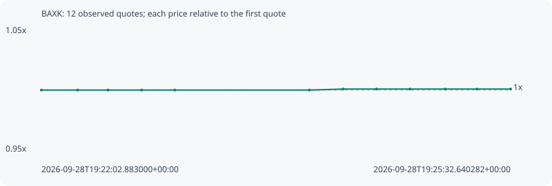

# BAXK

**bsc** / `0x616d821f756d537809b8a920a1a8aa28738f4444`

[All tokens](README.md) · [Market window](../README.md)

## Native assessments

This contract is in the quote cohort; it has no native model assessment in this window.

## Series f8804bd20cb59d2bb5f4

Pool: `not supplied`

[Complete series](../series/bsc/f8804bd20cb59d2bb5f4.json)

Every dot is a captured quote. Lines connect observations; the curve ends at the last available quote.

| Peak | Final | Return | Maximum drawdown |
| ---: | ---: | ---: | ---: |
| 1.0008x | 1.0008x | +0.08% | 0.00% |

### Complete quote timeline

| Time (UTC) | Price (USD) | Multiple | Evidence |
| --- | ---: | ---: | --- |
| 2026-09-28T19:22:02.883000+00:00 | 0.000645215 | 1.0000x | `capture:eb8228cb-dfba-443e-9576-ee214dcd3354:rank:95` |
| 2026-09-28T19:22:19.090071+00:00 | 0.000645215 | 1.0000x | `capture:30ef0b61-e0e1-4eba-95c6-de3dc48fe868:rank:94` |
| 2026-09-28T19:22:32.671189+00:00 | 0.000645215 | 1.0000x | `capture:5d031323-644d-4272-bacc-8a363d4b77cb:rank:98` |
| 2026-09-28T19:22:47.674643+00:00 | 0.000645215 | 1.0000x | `capture:c8838291-6f5a-42d9-9013-9d9421deb79e:rank:94` |
| 2026-09-28T19:23:02.516005+00:00 | 0.000645215 | 1.0000x | `capture:f8b60e63-80ce-442a-9ca7-659f2b5ca21d:rank:98` |
| 2026-09-28T19:24:02.684719+00:00 | 0.000645215 | 1.0000x | `capture:77fa5264-b080-4409-8d15-3f5504293a7d:rank:96` |
| 2026-09-28T19:24:17.754261+00:00 | 0.000645747 | 1.0008x | `capture:9e642626-a894-4304-aad8-bfad3e85b1e6:rank:82` |
| 2026-09-28T19:24:32.694463+00:00 | 0.000645747 | 1.0008x | `capture:2934d705-4adf-40dc-b5ef-2f9f3edbbe61:rank:82` |
| 2026-09-28T19:24:47.591753+00:00 | 0.000645747 | 1.0008x | `capture:1cb45dcb-fe83-4fcc-8cfd-c5de8d369858:rank:82` |
| 2026-09-28T19:25:03.394485+00:00 | 0.000645747 | 1.0008x | `capture:f1b0620f-7caf-483d-8db4-440b4d786962:rank:83` |
| 2026-09-28T19:25:17.566680+00:00 | 0.000645747 | 1.0008x | `capture:89c3d45d-a145-4312-88dc-a4340e727616:rank:85` |
| 2026-09-28T19:25:32.640282+00:00 | 0.000645747 | 1.0008x | `capture:a41f01eb-b1b7-4ed5-a604-19b71e522502:rank:86` |

### Exit-policy timeline

Calculated from captured quotes under the window policy. Native assessments are linked separately above.

| Time (UTC) | Action | Price (USD) | Evidence |
| --- | --- | ---: | --- |
| 2026-09-28T19:22:02.883000+00:00 | BUY | 0.000645215 | `capture:eb8228cb-dfba-443e-9576-ee214dcd3354:rank:95` |
| 2026-09-28T19:22:19.090071+00:00 | HOLD | 0.000645215 | `capture:30ef0b61-e0e1-4eba-95c6-de3dc48fe868:rank:94` |
| 2026-09-28T19:22:32.671189+00:00 | HOLD | 0.000645215 | `capture:5d031323-644d-4272-bacc-8a363d4b77cb:rank:98` |
| 2026-09-28T19:22:47.674643+00:00 | HOLD | 0.000645215 | `capture:c8838291-6f5a-42d9-9013-9d9421deb79e:rank:94` |
| 2026-09-28T19:23:02.516005+00:00 | HOLD | 0.000645215 | `capture:f8b60e63-80ce-442a-9ca7-659f2b5ca21d:rank:98` |
| 2026-09-28T19:24:02.684719+00:00 | HOLD | 0.000645215 | `capture:77fa5264-b080-4409-8d15-3f5504293a7d:rank:96` |
| 2026-09-28T19:24:17.754261+00:00 | HOLD | 0.000645747 | `capture:9e642626-a894-4304-aad8-bfad3e85b1e6:rank:82` |
| 2026-09-28T19:24:32.694463+00:00 | HOLD | 0.000645747 | `capture:2934d705-4adf-40dc-b5ef-2f9f3edbbe61:rank:82` |
| 2026-09-28T19:24:47.591753+00:00 | HOLD | 0.000645747 | `capture:1cb45dcb-fe83-4fcc-8cfd-c5de8d369858:rank:82` |
| 2026-09-28T19:25:03.394485+00:00 | HOLD | 0.000645747 | `capture:f1b0620f-7caf-483d-8db4-440b4d786962:rank:83` |
| 2026-09-28T19:25:17.566680+00:00 | HOLD | 0.000645747 | `capture:89c3d45d-a145-4312-88dc-a4340e727616:rank:85` |
| 2026-09-28T19:25:32.640282+00:00 | HOLD | 0.000645747 | `capture:a41f01eb-b1b7-4ed5-a604-19b71e522502:rank:86` |
