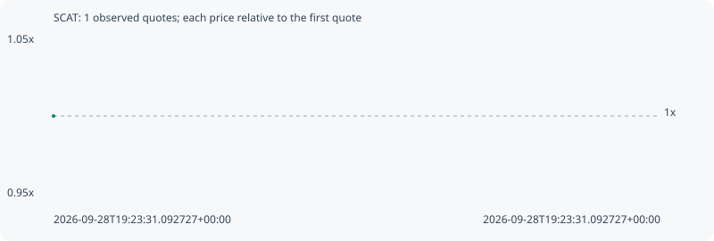

# SCAT

**solana** / `68U457cJxhAQ9gz1QivaD6sHtDpe1gXtcehnpiiGSpmA`

[All tokens](README.md) · [Market window](../README.md)

## Native assessments

This contract is in the quote cohort; it has no native model assessment in this window.

## Series 49b067f04d5e9564b3e7

Pool: `not supplied`

[Complete series](../series/solana/49b067f04d5e9564b3e7.json)

Every dot is a captured quote. Lines connect observations; the curve ends at the last available quote.

Fewer than two quotes: return and drawdown are not calculated.

### Complete quote timeline

| Time (UTC) | Price (USD) | Multiple | Evidence |
| --- | ---: | ---: | --- |
| 2026-09-28T19:23:31.092727+00:00 | 6.8038e-06 | 1.0000x | `capture:0e687519-8b01-4d7e-b48c-e2ec34135d17:rank:62` |

### Exit-policy timeline

Calculated from captured quotes under the window policy. Native assessments are linked separately above.

| Time (UTC) | Action | Price (USD) | Evidence |
| --- | --- | ---: | --- |
