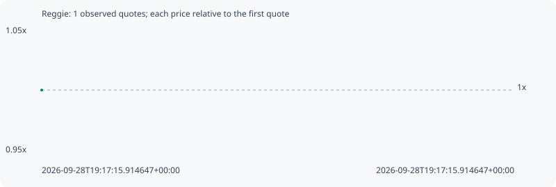

# Reggie

**solana** / `8HES3xmbpDGQiv1SxM4mmzPuNqb3R1QhfPCFg2aspump`

[All tokens](README.md) · [Market window](../README.md)

## Native assessments

- [2026-09-28T19:17:15.914647Z](../cases/9d2d7537385c8449.md): source parameters and model answers.

## Series 73149bd961f0bb6f34d1

Pool: `not supplied`

[Complete series](../series/solana/73149bd961f0bb6f34d1.json)

Every dot is a captured quote. Lines connect observations; the curve ends at the last available quote.

Fewer than two quotes: return and drawdown are not calculated.

### Complete quote timeline

| Time (UTC) | Price (USD) | Multiple | Evidence |
| --- | ---: | ---: | --- |
| 2026-09-28T19:17:15.914647+00:00 | 4.67202e-06 | 1.0000x | `capture:9792e199-c0c2-4272-ac95-24501e4a3f79:rank:67` |

### Exit-policy timeline

Calculated from captured quotes under the window policy. Native assessments are linked separately above.

| Time (UTC) | Action | Price (USD) | Evidence |
| --- | --- | ---: | --- |
