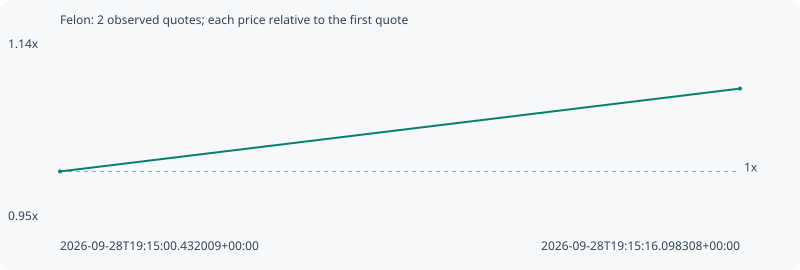

# Felon

**solana** / `snSekSZEHCjoSsKk5J2GYyNSoQSvskSp4RpUQuNpump`

[All tokens](README.md) · [Market window](../README.md)

## Native assessments

This contract is in the quote cohort; it has no native model assessment in this window.

## Series cf5b58e895c424e256bb

Pool: `not supplied`

[Complete series](../series/solana/cf5b58e895c424e256bb.json)

Every dot is a captured quote. Lines connect observations; the curve ends at the last available quote.

| Peak | Final | Return | Maximum drawdown |
| ---: | ---: | ---: | ---: |
| 1.0853x | 1.0853x | +8.53% | 0.00% |

### Complete quote timeline

| Time (UTC) | Price (USD) | Multiple | Evidence |
| --- | ---: | ---: | --- |
| 2026-09-28T19:15:00.432009+00:00 | 7.02176e-06 | 1.0000x | `capture:797f9a41-958a-44ba-ac57-3b9cacf5d06b:rank:88` |
| 2026-09-28T19:15:16.098308+00:00 | 7.62075e-06 | 1.0853x | `capture:ab2becb9-3f94-4a57-b9e8-472ad0998012:rank:64` |

### Exit-policy timeline

Calculated from captured quotes under the window policy. Native assessments are linked separately above.

| Time (UTC) | Action | Price (USD) | Evidence |
| --- | --- | ---: | --- |
| 2026-09-28T19:15:00.432009+00:00 | BUY | 7.02176e-06 | `capture:797f9a41-958a-44ba-ac57-3b9cacf5d06b:rank:88` |
| 2026-09-28T19:15:16.098308+00:00 | HOLD | 7.62075e-06 | `capture:ab2becb9-3f94-4a57-b9e8-472ad0998012:rank:64` |
