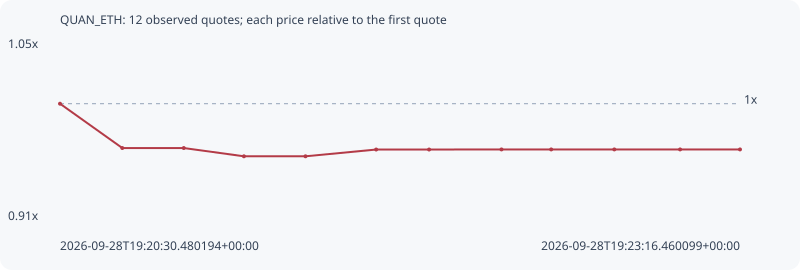

# QUAN_ETH

**solana** / `6U3d9bhCsSNruozUAWZN8UbP6YRxsPRKh122EArr29Z3`

[All tokens](README.md) · [Market window](../README.md)

## Native assessments

This contract is in the quote cohort; it has no native model assessment in this window.

## Series 4bf4c338ad4c8e223d0a

Pool: `not supplied`

[Complete series](../series/solana/4bf4c338ad4c8e223d0a.json)

Every dot is a captured quote. Lines connect observations; the curve ends at the last available quote.

| Peak | Final | Return | Maximum drawdown |
| ---: | ---: | ---: | ---: |
| 1.0000x | 0.9641x | -3.59% | 4.13% |

### Complete quote timeline

| Time (UTC) | Price (USD) | Multiple | Evidence |
| --- | ---: | ---: | --- |
| 2026-09-28T19:20:30.480194+00:00 | 4.37026e-06 | 1.0000x | `capture:54722132-db1d-4a2b-8c1c-2b0e71d01430:rank:98` |
| 2026-09-28T19:20:45.683165+00:00 | 4.21819e-06 | 0.9652x | `capture:17963a37-fd65-46b6-8e1c-350082721f8c:rank:97` |
| 2026-09-28T19:21:00.690136+00:00 | 4.21819e-06 | 0.9652x | `capture:f2ff842d-38e9-4cbe-a281-98c17d5a5672:rank:94` |
| 2026-09-28T19:21:15.372716+00:00 | 4.18985e-06 | 0.9587x | `capture:a923b968-a768-495e-ae33-6de2042c551f:rank:91` |
| 2026-09-28T19:21:30.402460+00:00 | 4.18985e-06 | 0.9587x | `capture:d926629b-2050-4e50-a602-1638c6205870:rank:83` |
| 2026-09-28T19:21:47.649380+00:00 | 4.21304e-06 | 0.9640x | `capture:0799ec6d-0e89-46b5-ae88-5695bf6c5fc3:rank:84` |
| 2026-09-28T19:22:00.569928+00:00 | 4.21304e-06 | 0.9640x | `capture:263cda40-4b31-4b2d-b168-fa4310edb46d:rank:84` |
| 2026-09-28T19:22:18.240717+00:00 | 4.21339e-06 | 0.9641x | `capture:546b2c55-1845-4da7-bc9c-4439cd0ccdba:rank:78` |
| 2026-09-28T19:22:30.371968+00:00 | 4.21339e-06 | 0.9641x | `capture:507d17cb-af67-4a81-a2b2-d5ddfbc40021:rank:84` |
| 2026-09-28T19:22:45.783808+00:00 | 4.21339e-06 | 0.9641x | `capture:9558d322-c429-480b-885f-82f4481c8506:rank:86` |
| 2026-09-28T19:23:01.833252+00:00 | 4.21339e-06 | 0.9641x | `capture:c5462412-2da1-4432-8949-8fcd1492c57f:rank:82` |
| 2026-09-28T19:23:16.460099+00:00 | 4.21339e-06 | 0.9641x | `capture:2d456a2a-6755-4e1d-9a80-b6e3b2d44ec1:rank:83` |

### Exit-policy timeline

Calculated from captured quotes under the window policy. Native assessments are linked separately above.

| Time (UTC) | Action | Price (USD) | Evidence |
| --- | --- | ---: | --- |
| 2026-09-28T19:20:30.480194+00:00 | BUY | 4.37026e-06 | `capture:54722132-db1d-4a2b-8c1c-2b0e71d01430:rank:98` |
| 2026-09-28T19:20:45.683165+00:00 | HOLD | 4.21819e-06 | `capture:17963a37-fd65-46b6-8e1c-350082721f8c:rank:97` |
| 2026-09-28T19:21:00.690136+00:00 | HOLD | 4.21819e-06 | `capture:f2ff842d-38e9-4cbe-a281-98c17d5a5672:rank:94` |
| 2026-09-28T19:21:15.372716+00:00 | HOLD | 4.18985e-06 | `capture:a923b968-a768-495e-ae33-6de2042c551f:rank:91` |
| 2026-09-28T19:21:30.402460+00:00 | HOLD | 4.18985e-06 | `capture:d926629b-2050-4e50-a602-1638c6205870:rank:83` |
| 2026-09-28T19:21:47.649380+00:00 | HOLD | 4.21304e-06 | `capture:0799ec6d-0e89-46b5-ae88-5695bf6c5fc3:rank:84` |
| 2026-09-28T19:22:00.569928+00:00 | HOLD | 4.21304e-06 | `capture:263cda40-4b31-4b2d-b168-fa4310edb46d:rank:84` |
| 2026-09-28T19:22:18.240717+00:00 | HOLD | 4.21339e-06 | `capture:546b2c55-1845-4da7-bc9c-4439cd0ccdba:rank:78` |
| 2026-09-28T19:22:30.371968+00:00 | HOLD | 4.21339e-06 | `capture:507d17cb-af67-4a81-a2b2-d5ddfbc40021:rank:84` |
| 2026-09-28T19:22:45.783808+00:00 | HOLD | 4.21339e-06 | `capture:9558d322-c429-480b-885f-82f4481c8506:rank:86` |
| 2026-09-28T19:23:01.833252+00:00 | HOLD | 4.21339e-06 | `capture:c5462412-2da1-4432-8949-8fcd1492c57f:rank:82` |
| 2026-09-28T19:23:16.460099+00:00 | HOLD | 4.21339e-06 | `capture:2d456a2a-6755-4e1d-9a80-b6e3b2d44ec1:rank:83` |
