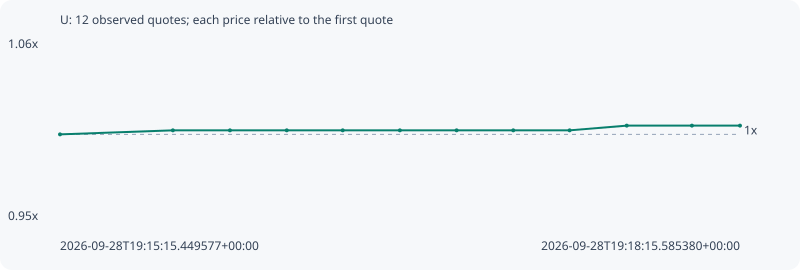

# U

**robinhood** / `0x3e17c94ba8112380ef81a43fc33b08ca6284fb33`

[All tokens](README.md) · [Market window](../README.md)

## Native assessments

This contract is in the quote cohort; it has no native model assessment in this window.

## Series aaac936d48be109bc70f

Pool: `not supplied`

[Complete series](../series/robinhood/aaac936d48be109bc70f.json)

Every dot is a captured quote. Lines connect observations; the curve ends at the last available quote.

| Peak | Final | Return | Maximum drawdown |
| ---: | ---: | ---: | ---: |
| 1.0051x | 1.0051x | +0.51% | 0.00% |

### Complete quote timeline

| Time (UTC) | Price (USD) | Multiple | Evidence |
| --- | ---: | ---: | --- |
| 2026-09-28T19:15:15.449577+00:00 | 0.000140439 | 1.0000x | `capture:14452070-ab94-45a0-af6d-e6c54082daec:rank:99` |
| 2026-09-28T19:15:45.353664+00:00 | 0.000140769 | 1.0023x | `capture:b9051b67-24e1-4469-9f82-bc08bd56807d:rank:79` |
| 2026-09-28T19:16:00.473367+00:00 | 0.000140769 | 1.0023x | `capture:cd404827-1073-4901-b09c-82ef1488855b:rank:77` |
| 2026-09-28T19:16:15.518445+00:00 | 0.000140769 | 1.0023x | `capture:c193221c-c80a-4a3b-ad88-59f12dcb1689:rank:87` |
| 2026-09-28T19:16:30.344303+00:00 | 0.000140769 | 1.0023x | `capture:18d587e7-b24d-4b8d-82f1-0ac2903a3303:rank:96` |
| 2026-09-28T19:16:45.486467+00:00 | 0.000140769 | 1.0023x | `capture:4ca26bf7-9d1e-455b-a63e-1b5df831b997:rank:95` |
| 2026-09-28T19:17:00.510014+00:00 | 0.000140769 | 1.0023x | `capture:d9309a4d-09d7-45ee-91ce-c4a055e8faac:rank:95` |
| 2026-09-28T19:17:15.523068+00:00 | 0.000140769 | 1.0023x | `capture:333d670d-dbd3-4656-95f9-1bc781b271db:rank:97` |
| 2026-09-28T19:17:30.451540+00:00 | 0.000140769 | 1.0023x | `capture:e161007c-0751-46e4-acc9-c8e28cd7190a:rank:93` |
| 2026-09-28T19:17:45.582227+00:00 | 0.000141155 | 1.0051x | `capture:a3f98285-516a-4bd4-b2c4-63596c968a6b:rank:86` |
| 2026-09-28T19:18:02.849542+00:00 | 0.000141155 | 1.0051x | `capture:53a348cd-74d6-4031-ba2b-02d70c63e42b:rank:95` |
| 2026-09-28T19:18:15.585380+00:00 | 0.000141155 | 1.0051x | `capture:ea19027f-d2c1-43cc-973f-0d8eb46ed64e:rank:98` |

### Exit-policy timeline

Calculated from captured quotes under the window policy. Native assessments are linked separately above.

| Time (UTC) | Action | Price (USD) | Evidence |
| --- | --- | ---: | --- |
| 2026-09-28T19:15:15.449577+00:00 | BUY | 0.000140439 | `capture:14452070-ab94-45a0-af6d-e6c54082daec:rank:99` |
| 2026-09-28T19:15:45.353664+00:00 | HOLD | 0.000140769 | `capture:b9051b67-24e1-4469-9f82-bc08bd56807d:rank:79` |
| 2026-09-28T19:16:00.473367+00:00 | HOLD | 0.000140769 | `capture:cd404827-1073-4901-b09c-82ef1488855b:rank:77` |
| 2026-09-28T19:16:15.518445+00:00 | HOLD | 0.000140769 | `capture:c193221c-c80a-4a3b-ad88-59f12dcb1689:rank:87` |
| 2026-09-28T19:16:30.344303+00:00 | HOLD | 0.000140769 | `capture:18d587e7-b24d-4b8d-82f1-0ac2903a3303:rank:96` |
| 2026-09-28T19:16:45.486467+00:00 | HOLD | 0.000140769 | `capture:4ca26bf7-9d1e-455b-a63e-1b5df831b997:rank:95` |
| 2026-09-28T19:17:00.510014+00:00 | HOLD | 0.000140769 | `capture:d9309a4d-09d7-45ee-91ce-c4a055e8faac:rank:95` |
| 2026-09-28T19:17:15.523068+00:00 | HOLD | 0.000140769 | `capture:333d670d-dbd3-4656-95f9-1bc781b271db:rank:97` |
| 2026-09-28T19:17:30.451540+00:00 | HOLD | 0.000140769 | `capture:e161007c-0751-46e4-acc9-c8e28cd7190a:rank:93` |
| 2026-09-28T19:17:45.582227+00:00 | HOLD | 0.000141155 | `capture:a3f98285-516a-4bd4-b2c4-63596c968a6b:rank:86` |
| 2026-09-28T19:18:02.849542+00:00 | HOLD | 0.000141155 | `capture:53a348cd-74d6-4031-ba2b-02d70c63e42b:rank:95` |
| 2026-09-28T19:18:15.585380+00:00 | HOLD | 0.000141155 | `capture:ea19027f-d2c1-43cc-973f-0d8eb46ed64e:rank:98` |
