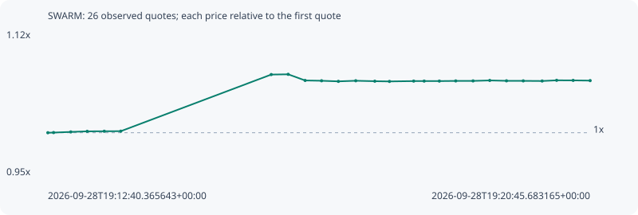

# SWARM

**solana** / `5g9PWcRUHpmqm5uKycpShKXJB18sGLeCEzgB3qrRpump`

[All tokens](README.md) · [Market window](../README.md)

## Native assessments

This contract is in the quote cohort; it has no native model assessment in this window.

## Series c2a1b83e18c03a760c18

Pool: `not supplied`

[Complete series](../series/solana/c2a1b83e18c03a760c18.json)

Every dot is a captured quote. Lines connect observations; the curve ends at the last available quote.

| Peak | Final | Return | Maximum drawdown |
| ---: | ---: | ---: | ---: |
| 1.0688x | 1.0614x | +6.14% | 0.78% |

### Complete quote timeline

| Time (UTC) | Price (USD) | Multiple | Evidence |
| --- | ---: | ---: | --- |
| 2026-09-28T19:12:40.365643+00:00 | 0.00013367 | 1.0000x | `capture:3af1faa1-2074-484e-893e-ed2c676e1576:rank:38` |
| 2026-09-28T19:12:45.490977+00:00 | 0.000133693 | 1.0002x | `capture:ac0279d6-7dd1-44b6-bf3e-910bf7b8eddf:rank:38` |
| 2026-09-28T19:13:00.884337+00:00 | 0.000133795 | 1.0009x | `capture:5867894f-39b4-4bcd-bd87-86394c63aab4:rank:37` |
| 2026-09-28T19:13:15.565374+00:00 | 0.000133887 | 1.0016x | `capture:ca31b3d4-ad60-4333-98b3-6d940a196f86:rank:41` |
| 2026-09-28T19:13:30.833894+00:00 | 0.000133901 | 1.0017x | `capture:2beb38a4-bfac-4502-bbc3-8c8c0f943007:rank:43` |
| 2026-09-28T19:13:45.640151+00:00 | 0.000133913 | 1.0018x | `capture:4d31b656-3ffe-4768-bef6-377adf019420:rank:41` |
| 2026-09-28T19:16:00.259696+00:00 | 0.000142825 | 1.0685x | `capture:4236f8d5-90c4-4c9b-a73e-d6443ae3bf32:rank:31` |
| 2026-09-28T19:16:15.455827+00:00 | 0.000142863 | 1.0688x | `capture:acc657c6-9a43-46bf-986e-7b907c831cba:rank:31` |
| 2026-09-28T19:16:30.624202+00:00 | 0.000141895 | 1.0615x | `capture:0d391072-ec81-4bb7-9be0-0d6bbb801c70:rank:33` |
| 2026-09-28T19:16:45.311485+00:00 | 0.000141848 | 1.0612x | `capture:72cccbac-c3fe-4991-8f62-08c53849b146:rank:34` |
| 2026-09-28T19:17:00.368914+00:00 | 0.000141754 | 1.0605x | `capture:1232cf18-7088-40a1-9f55-ad9ae22b44f5:rank:33` |
| 2026-09-28T19:17:15.914647+00:00 | 0.00014185 | 1.0612x | `capture:9792e199-c0c2-4272-ac95-24501e4a3f79:rank:33` |
| 2026-09-28T19:17:32.965607+00:00 | 0.00014178 | 1.0607x | `capture:0f04cfe5-88a0-4a83-ae8d-85c5cb3cdc89:rank:34` |
| 2026-09-28T19:17:46.087880+00:00 | 0.000141745 | 1.0604x | `capture:ee91a1c6-bc99-4c7a-9cdc-bd6cb5478a9b:rank:35` |
| 2026-09-28T19:18:07.749963+00:00 | 0.000141797 | 1.0608x | `capture:b0fb1b47-4973-472f-9619-8480bc7d294e:rank:38` |
| 2026-09-28T19:18:17.126008+00:00 | 0.000141797 | 1.0608x | `capture:5ed98f51-d1e1-422a-81df-4186a8b0a0a2:rank:39` |
| 2026-09-28T19:18:30.722167+00:00 | 0.000141798 | 1.0608x | `capture:9f88d118-9108-4dff-bbfc-246eaed5ce38:rank:40` |
| 2026-09-28T19:18:45.386687+00:00 | 0.000141823 | 1.0610x | `capture:f533100a-ce62-4457-9107-42e7601ea5d7:rank:38` |
| 2026-09-28T19:19:00.883835+00:00 | 0.000141826 | 1.0610x | `capture:a2495d99-5671-4c7e-b87c-48f48d90f2f2:rank:38` |
| 2026-09-28T19:19:15.826416+00:00 | 0.000141899 | 1.0616x | `capture:ba1dc6a3-b8b7-461a-8110-8490f03539a5:rank:35` |
| 2026-09-28T19:19:30.814098+00:00 | 0.000141839 | 1.0611x | `capture:b25d90dc-c8db-4388-8a2b-d06541e5320f:rank:35` |
| 2026-09-28T19:19:45.817199+00:00 | 0.000141831 | 1.0611x | `capture:722d1b7b-ef4f-4ac5-883c-0557bae2b60b:rank:34` |
| 2026-09-28T19:20:02.715590+00:00 | 0.00014181 | 1.0609x | `capture:60ff17d8-3b18-4f61-9bc7-006afd324cf2:rank:33` |
| 2026-09-28T19:20:15.699547+00:00 | 0.000141918 | 1.0617x | `capture:10a94828-637f-4580-a9f7-2fbd34d8589a:rank:34` |
| 2026-09-28T19:20:30.480194+00:00 | 0.000141907 | 1.0616x | `capture:54722132-db1d-4a2b-8c1c-2b0e71d01430:rank:35` |
| 2026-09-28T19:20:45.683165+00:00 | 0.000141873 | 1.0614x | `capture:17963a37-fd65-46b6-8e1c-350082721f8c:rank:34` |

### Exit-policy timeline

Calculated from captured quotes under the window policy. Native assessments are linked separately above.

| Time (UTC) | Action | Price (USD) | Evidence |
| --- | --- | ---: | --- |
| 2026-09-28T19:12:40.365643+00:00 | BUY | 0.00013367 | `capture:3af1faa1-2074-484e-893e-ed2c676e1576:rank:38` |
| 2026-09-28T19:12:45.490977+00:00 | HOLD | 0.000133693 | `capture:ac0279d6-7dd1-44b6-bf3e-910bf7b8eddf:rank:38` |
| 2026-09-28T19:13:00.884337+00:00 | HOLD | 0.000133795 | `capture:5867894f-39b4-4bcd-bd87-86394c63aab4:rank:37` |
| 2026-09-28T19:13:15.565374+00:00 | HOLD | 0.000133887 | `capture:ca31b3d4-ad60-4333-98b3-6d940a196f86:rank:41` |
| 2026-09-28T19:13:30.833894+00:00 | HOLD | 0.000133901 | `capture:2beb38a4-bfac-4502-bbc3-8c8c0f943007:rank:43` |
| 2026-09-28T19:13:45.640151+00:00 | HOLD | 0.000133913 | `capture:4d31b656-3ffe-4768-bef6-377adf019420:rank:41` |
| 2026-09-28T19:16:00.259696+00:00 | HOLD | 0.000142825 | `capture:4236f8d5-90c4-4c9b-a73e-d6443ae3bf32:rank:31` |
| 2026-09-28T19:16:15.455827+00:00 | HOLD | 0.000142863 | `capture:acc657c6-9a43-46bf-986e-7b907c831cba:rank:31` |
| 2026-09-28T19:16:30.624202+00:00 | HOLD | 0.000141895 | `capture:0d391072-ec81-4bb7-9be0-0d6bbb801c70:rank:33` |
| 2026-09-28T19:16:45.311485+00:00 | HOLD | 0.000141848 | `capture:72cccbac-c3fe-4991-8f62-08c53849b146:rank:34` |
| 2026-09-28T19:17:00.368914+00:00 | HOLD | 0.000141754 | `capture:1232cf18-7088-40a1-9f55-ad9ae22b44f5:rank:33` |
| 2026-09-28T19:17:15.914647+00:00 | HOLD | 0.00014185 | `capture:9792e199-c0c2-4272-ac95-24501e4a3f79:rank:33` |
| 2026-09-28T19:17:32.965607+00:00 | HOLD | 0.00014178 | `capture:0f04cfe5-88a0-4a83-ae8d-85c5cb3cdc89:rank:34` |
| 2026-09-28T19:17:46.087880+00:00 | HOLD | 0.000141745 | `capture:ee91a1c6-bc99-4c7a-9cdc-bd6cb5478a9b:rank:35` |
| 2026-09-28T19:18:07.749963+00:00 | HOLD | 0.000141797 | `capture:b0fb1b47-4973-472f-9619-8480bc7d294e:rank:38` |
| 2026-09-28T19:18:17.126008+00:00 | HOLD | 0.000141797 | `capture:5ed98f51-d1e1-422a-81df-4186a8b0a0a2:rank:39` |
| 2026-09-28T19:18:30.722167+00:00 | HOLD | 0.000141798 | `capture:9f88d118-9108-4dff-bbfc-246eaed5ce38:rank:40` |
| 2026-09-28T19:18:45.386687+00:00 | HOLD | 0.000141823 | `capture:f533100a-ce62-4457-9107-42e7601ea5d7:rank:38` |
| 2026-09-28T19:19:00.883835+00:00 | HOLD | 0.000141826 | `capture:a2495d99-5671-4c7e-b87c-48f48d90f2f2:rank:38` |
| 2026-09-28T19:19:15.826416+00:00 | HOLD | 0.000141899 | `capture:ba1dc6a3-b8b7-461a-8110-8490f03539a5:rank:35` |
| 2026-09-28T19:19:30.814098+00:00 | HOLD | 0.000141839 | `capture:b25d90dc-c8db-4388-8a2b-d06541e5320f:rank:35` |
| 2026-09-28T19:19:45.817199+00:00 | HOLD | 0.000141831 | `capture:722d1b7b-ef4f-4ac5-883c-0557bae2b60b:rank:34` |
| 2026-09-28T19:20:02.715590+00:00 | HOLD | 0.00014181 | `capture:60ff17d8-3b18-4f61-9bc7-006afd324cf2:rank:33` |
| 2026-09-28T19:20:15.699547+00:00 | HOLD | 0.000141918 | `capture:10a94828-637f-4580-a9f7-2fbd34d8589a:rank:34` |
| 2026-09-28T19:20:30.480194+00:00 | HOLD | 0.000141907 | `capture:54722132-db1d-4a2b-8c1c-2b0e71d01430:rank:35` |
| 2026-09-28T19:20:45.683165+00:00 | HOLD | 0.000141873 | `capture:17963a37-fd65-46b6-8e1c-350082721f8c:rank:34` |
