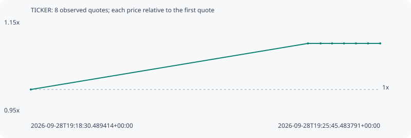

# TICKER

**robinhood** / `0x6c43086993f904499a24e6df42c7e785ea1843e7`

[All tokens](README.md) · [Market window](../README.md)

## Native assessments

This contract is in the quote cohort; it has no native model assessment in this window.

## Series a1ea44a4714021afe58d

Pool: `not supplied`

[Complete series](../series/robinhood/a1ea44a4714021afe58d.json)

Every dot is a captured quote. Lines connect observations; the curve ends at the last available quote.

| Peak | Final | Return | Maximum drawdown |
| ---: | ---: | ---: | ---: |
| 1.1003x | 1.1003x | +10.03% | 0.00% |

### Complete quote timeline

| Time (UTC) | Price (USD) | Multiple | Evidence |
| --- | ---: | ---: | --- |
| 2026-09-28T19:18:30.489414+00:00 | 2.26002e-05 | 1.0000x | `capture:c5cd70df-4ca4-4388-b3c5-f977fa86f8a2:rank:98` |
| 2026-09-28T19:24:15.505143+00:00 | 2.48669e-05 | 1.1003x | `capture:b7273a78-8f87-4dcc-877e-f47f549e0fe8:rank:95` |
| 2026-09-28T19:24:31.344409+00:00 | 2.48669e-05 | 1.1003x | `capture:85f4db1c-c852-45c3-99aa-4320f3839031:rank:96` |
| 2026-09-28T19:24:45.576445+00:00 | 2.48669e-05 | 1.1003x | `capture:da07dfaa-56d9-4a51-99df-1ad071803eb0:rank:99` |
| 2026-09-28T19:25:00.412700+00:00 | 2.48669e-05 | 1.1003x | `capture:1dec2f8f-4694-4c32-8be8-eeec3980c853:rank:98` |
| 2026-09-28T19:25:15.316372+00:00 | 2.48669e-05 | 1.1003x | `capture:52eaf5a3-351e-4c29-b00b-a167107703e3:rank:99` |
| 2026-09-28T19:25:30.354898+00:00 | 2.48669e-05 | 1.1003x | `capture:d70b1f6a-3ec3-4ec2-8c88-db476beae4f9:rank:96` |
| 2026-09-28T19:25:45.483791+00:00 | 2.48669e-05 | 1.1003x | `capture:ebb21e05-3dc6-4a8f-a800-fa79ba147200:rank:96` |

### Exit-policy timeline

Calculated from captured quotes under the window policy. Native assessments are linked separately above.

| Time (UTC) | Action | Price (USD) | Evidence |
| --- | --- | ---: | --- |
| 2026-09-28T19:18:30.489414+00:00 | BUY | 2.26002e-05 | `capture:c5cd70df-4ca4-4388-b3c5-f977fa86f8a2:rank:98` |
| 2026-09-28T19:24:15.505143+00:00 | HOLD | 2.48669e-05 | `capture:b7273a78-8f87-4dcc-877e-f47f549e0fe8:rank:95` |
| 2026-09-28T19:24:31.344409+00:00 | HOLD | 2.48669e-05 | `capture:85f4db1c-c852-45c3-99aa-4320f3839031:rank:96` |
| 2026-09-28T19:24:45.576445+00:00 | HOLD | 2.48669e-05 | `capture:da07dfaa-56d9-4a51-99df-1ad071803eb0:rank:99` |
| 2026-09-28T19:25:00.412700+00:00 | HOLD | 2.48669e-05 | `capture:1dec2f8f-4694-4c32-8be8-eeec3980c853:rank:98` |
| 2026-09-28T19:25:15.316372+00:00 | HOLD | 2.48669e-05 | `capture:52eaf5a3-351e-4c29-b00b-a167107703e3:rank:99` |
| 2026-09-28T19:25:30.354898+00:00 | HOLD | 2.48669e-05 | `capture:d70b1f6a-3ec3-4ec2-8c88-db476beae4f9:rank:96` |
| 2026-09-28T19:25:45.483791+00:00 | HOLD | 2.48669e-05 | `capture:ebb21e05-3dc6-4a8f-a800-fa79ba147200:rank:96` |
