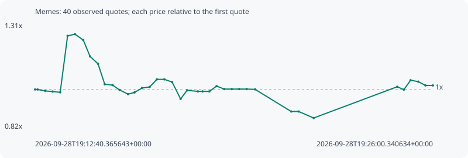

# Memes

**solana** / `7dACCWZXF4Lr9ftxFpi7TJk7a3hcPpUwGPAcTuXDpump`

[All tokens](README.md) · [Market window](../README.md)

## Native assessments

This contract is in the quote cohort; it has no native model assessment in this window.

## Series 15217a6c690f24a65d63

Pool: `not supplied`

[Complete series](../series/solana/15217a6c690f24a65d63.json)

Every dot is a captured quote. Lines connect observations; the curve ends at the last available quote.

| Peak | Final | Return | Maximum drawdown |
| ---: | ---: | ---: | ---: |
| 1.2569x | 1.0188x | +1.88% | 30.96% |

### Complete quote timeline

| Time (UTC) | Price (USD) | Multiple | Evidence |
| --- | ---: | ---: | --- |
| 2026-09-28T19:12:40.365643+00:00 | 4.79736e-06 | 1.0000x | `capture:3af1faa1-2074-484e-893e-ed2c676e1576:rank:51` |
| 2026-09-28T19:12:45.490977+00:00 | 4.79736e-06 | 1.0000x | `capture:ac0279d6-7dd1-44b6-bf3e-910bf7b8eddf:rank:50` |
| 2026-09-28T19:13:00.884337+00:00 | 4.76579e-06 | 0.9934x | `capture:5867894f-39b4-4bcd-bd87-86394c63aab4:rank:59` |
| 2026-09-28T19:13:15.565374+00:00 | 4.75148e-06 | 0.9904x | `capture:ca31b3d4-ad60-4333-98b3-6d940a196f86:rank:59` |
| 2026-09-28T19:13:30.833894+00:00 | 4.73456e-06 | 0.9869x | `capture:2beb38a4-bfac-4502-bbc3-8c8c0f943007:rank:62` |
| 2026-09-28T19:13:45.640151+00:00 | 5.99167e-06 | 1.2490x | `capture:4d31b656-3ffe-4768-bef6-377adf019420:rank:61` |
| 2026-09-28T19:14:00.595194+00:00 | 6.02963e-06 | 1.2569x | `capture:2c78112b-48e7-4f74-8c2e-1cb8642a79dc:rank:62` |
| 2026-09-28T19:14:17.246316+00:00 | 5.8979e-06 | 1.2294x | `capture:7a923cde-d765-4388-a15c-4f47fde0a3b5:rank:64` |
| 2026-09-28T19:14:30.874732+00:00 | 5.53385e-06 | 1.1535x | `capture:fa585070-b1ae-4f9d-afbd-aa986f487793:rank:66` |
| 2026-09-28T19:14:46.892387+00:00 | 5.36952e-06 | 1.1193x | `capture:7d9e3e65-8bda-4696-b6d1-7a86825bd98c:rank:69` |
| 2026-09-28T19:15:00.432009+00:00 | 4.91353e-06 | 1.0242x | `capture:797f9a41-958a-44ba-ac57-3b9cacf5d06b:rank:65` |
| 2026-09-28T19:15:16.098308+00:00 | 4.89483e-06 | 1.0203x | `capture:ab2becb9-3f94-4a57-b9e8-472ad0998012:rank:65` |
| 2026-09-28T19:15:30.340579+00:00 | 4.78602e-06 | 0.9976x | `capture:564db5fc-5586-41d3-88fb-a9a955708f1d:rank:71` |
| 2026-09-28T19:15:47.323285+00:00 | 4.69309e-06 | 0.9783x | `capture:65003429-a569-4442-8d4f-b2c93db69061:rank:69` |
| 2026-09-28T19:16:00.259696+00:00 | 4.73168e-06 | 0.9863x | `capture:4236f8d5-90c4-4c9b-a73e-d6443ae3bf32:rank:72` |
| 2026-09-28T19:16:15.455827+00:00 | 4.82967e-06 | 1.0067x | `capture:acc657c6-9a43-46bf-986e-7b907c831cba:rank:76` |
| 2026-09-28T19:16:30.624202+00:00 | 4.85401e-06 | 1.0118x | `capture:0d391072-ec81-4bb7-9be0-0d6bbb801c70:rank:78` |
| 2026-09-28T19:16:45.311485+00:00 | 5.02292e-06 | 1.0470x | `capture:72cccbac-c3fe-4991-8f62-08c53849b146:rank:78` |
| 2026-09-28T19:17:00.368914+00:00 | 5.02292e-06 | 1.0470x | `capture:1232cf18-7088-40a1-9f55-ad9ae22b44f5:rank:80` |
| 2026-09-28T19:17:15.914647+00:00 | 4.96322e-06 | 1.0346x | `capture:9792e199-c0c2-4272-ac95-24501e4a3f79:rank:82` |
| 2026-09-28T19:17:32.965607+00:00 | 4.58692e-06 | 0.9561x | `capture:0f04cfe5-88a0-4a83-ae8d-85c5cb3cdc89:rank:88` |
| 2026-09-28T19:17:46.087880+00:00 | 4.77983e-06 | 0.9963x | `capture:ee91a1c6-bc99-4c7a-9cdc-bd6cb5478a9b:rank:88` |
| 2026-09-28T19:18:07.749963+00:00 | 4.75452e-06 | 0.9911x | `capture:b0fb1b47-4973-472f-9619-8480bc7d294e:rank:88` |
| 2026-09-28T19:18:17.126008+00:00 | 4.75452e-06 | 0.9911x | `capture:5ed98f51-d1e1-422a-81df-4186a8b0a0a2:rank:86` |
| 2026-09-28T19:18:30.722167+00:00 | 4.75452e-06 | 0.9911x | `capture:9f88d118-9108-4dff-bbfc-246eaed5ce38:rank:89` |
| 2026-09-28T19:18:45.386687+00:00 | 4.87266e-06 | 1.0157x | `capture:f533100a-ce62-4457-9107-42e7601ea5d7:rank:86` |
| 2026-09-28T19:19:00.883835+00:00 | 4.80677e-06 | 1.0020x | `capture:a2495d99-5671-4c7e-b87c-48f48d90f2f2:rank:88` |
| 2026-09-28T19:19:15.826416+00:00 | 4.80677e-06 | 1.0020x | `capture:ba1dc6a3-b8b7-461a-8110-8490f03539a5:rank:90` |
| 2026-09-28T19:19:30.814098+00:00 | 4.80677e-06 | 1.0020x | `capture:b25d90dc-c8db-4388-8a2b-d06541e5320f:rank:99` |
| 2026-09-28T19:19:45.817199+00:00 | 4.80677e-06 | 1.0020x | `capture:722d1b7b-ef4f-4ac5-883c-0557bae2b60b:rank:99` |
| 2026-09-28T19:20:02.715590+00:00 | 4.80026e-06 | 1.0006x | `capture:60ff17d8-3b18-4f61-9bc7-006afd324cf2:rank:99` |
| 2026-09-28T19:21:15.372716+00:00 | 4.30668e-06 | 0.8977x | `capture:a923b968-a768-495e-ae33-6de2042c551f:rank:99` |
| 2026-09-28T19:21:30.402460+00:00 | 4.30668e-06 | 0.8977x | `capture:d926629b-2050-4e50-a602-1638c6205870:rank:94` |
| 2026-09-28T19:22:00.569928+00:00 | 4.16267e-06 | 0.8677x | `capture:263cda40-4b31-4b2d-b168-fa4310edb46d:rank:99` |
| 2026-09-28T19:24:48.687179+00:00 | 4.85866e-06 | 1.0128x | `capture:feb72cbd-a170-4ba3-8a11-eb1df1686719:rank:99` |
| 2026-09-28T19:25:01.877958+00:00 | 4.79347e-06 | 0.9992x | `capture:fd6d01ae-d246-439e-ac58-27ae75880eb9:rank:97` |
| 2026-09-28T19:25:15.488701+00:00 | 5.00345e-06 | 1.0430x | `capture:b8fee87c-9981-475c-930b-99c255910a9f:rank:95` |
| 2026-09-28T19:25:30.900173+00:00 | 4.97227e-06 | 1.0365x | `capture:7f757769-25c3-429a-81d0-c6b2ee45ee15:rank:97` |
| 2026-09-28T19:25:45.342895+00:00 | 4.88749e-06 | 1.0188x | `capture:0ca3656d-ce8c-444b-8f77-acf34c08a1f4:rank:94` |
| 2026-09-28T19:26:00.340634+00:00 | 4.88749e-06 | 1.0188x | `capture:5b3728c5-aff9-43f3-bbb5-25b251825caa:rank:98` |

### Exit-policy timeline

Calculated from captured quotes under the window policy. Native assessments are linked separately above.

| Time (UTC) | Action | Price (USD) | Evidence |
| --- | --- | ---: | --- |
| 2026-09-28T19:12:40.365643+00:00 | BUY | 4.79736e-06 | `capture:3af1faa1-2074-484e-893e-ed2c676e1576:rank:51` |
| 2026-09-28T19:12:45.490977+00:00 | HOLD | 4.79736e-06 | `capture:ac0279d6-7dd1-44b6-bf3e-910bf7b8eddf:rank:50` |
| 2026-09-28T19:13:00.884337+00:00 | HOLD | 4.76579e-06 | `capture:5867894f-39b4-4bcd-bd87-86394c63aab4:rank:59` |
| 2026-09-28T19:13:15.565374+00:00 | HOLD | 4.75148e-06 | `capture:ca31b3d4-ad60-4333-98b3-6d940a196f86:rank:59` |
| 2026-09-28T19:13:30.833894+00:00 | HOLD | 4.73456e-06 | `capture:2beb38a4-bfac-4502-bbc3-8c8c0f943007:rank:62` |
| 2026-09-28T19:13:45.640151+00:00 | HOLD | 5.99167e-06 | `capture:4d31b656-3ffe-4768-bef6-377adf019420:rank:61` |
| 2026-09-28T19:14:00.595194+00:00 | PROFIT | 6.02963e-06 | `capture:2c78112b-48e7-4f74-8c2e-1cb8642a79dc:rank:62` |
| 2026-09-28T19:14:17.246316+00:00 | HOLD_BAG | 5.8979e-06 | `capture:7a923cde-d765-4388-a15c-4f47fde0a3b5:rank:64` |
| 2026-09-28T19:14:30.874732+00:00 | HOLD_BAG | 5.53385e-06 | `capture:fa585070-b1ae-4f9d-afbd-aa986f487793:rank:66` |
| 2026-09-28T19:14:46.892387+00:00 | HOLD_BAG | 5.36952e-06 | `capture:7d9e3e65-8bda-4696-b6d1-7a86825bd98c:rank:69` |
| 2026-09-28T19:15:00.432009+00:00 | HOLD_BAG | 4.91353e-06 | `capture:797f9a41-958a-44ba-ac57-3b9cacf5d06b:rank:65` |
| 2026-09-28T19:15:16.098308+00:00 | HOLD_BAG | 4.89483e-06 | `capture:ab2becb9-3f94-4a57-b9e8-472ad0998012:rank:65` |
| 2026-09-28T19:15:30.340579+00:00 | HOLD_BAG | 4.78602e-06 | `capture:564db5fc-5586-41d3-88fb-a9a955708f1d:rank:71` |
| 2026-09-28T19:15:47.323285+00:00 | HOLD_BAG | 4.69309e-06 | `capture:65003429-a569-4442-8d4f-b2c93db69061:rank:69` |
| 2026-09-28T19:16:00.259696+00:00 | HOLD_BAG | 4.73168e-06 | `capture:4236f8d5-90c4-4c9b-a73e-d6443ae3bf32:rank:72` |
| 2026-09-28T19:16:15.455827+00:00 | HOLD_BAG | 4.82967e-06 | `capture:acc657c6-9a43-46bf-986e-7b907c831cba:rank:76` |
| 2026-09-28T19:16:30.624202+00:00 | HOLD_BAG | 4.85401e-06 | `capture:0d391072-ec81-4bb7-9be0-0d6bbb801c70:rank:78` |
| 2026-09-28T19:16:45.311485+00:00 | HOLD_BAG | 5.02292e-06 | `capture:72cccbac-c3fe-4991-8f62-08c53849b146:rank:78` |
| 2026-09-28T19:17:00.368914+00:00 | HOLD_BAG | 5.02292e-06 | `capture:1232cf18-7088-40a1-9f55-ad9ae22b44f5:rank:80` |
| 2026-09-28T19:17:15.914647+00:00 | HOLD_BAG | 4.96322e-06 | `capture:9792e199-c0c2-4272-ac95-24501e4a3f79:rank:82` |
| 2026-09-28T19:17:32.965607+00:00 | HOLD_BAG | 4.58692e-06 | `capture:0f04cfe5-88a0-4a83-ae8d-85c5cb3cdc89:rank:88` |
| 2026-09-28T19:17:46.087880+00:00 | HOLD_BAG | 4.77983e-06 | `capture:ee91a1c6-bc99-4c7a-9cdc-bd6cb5478a9b:rank:88` |
| 2026-09-28T19:18:07.749963+00:00 | HOLD_BAG | 4.75452e-06 | `capture:b0fb1b47-4973-472f-9619-8480bc7d294e:rank:88` |
| 2026-09-28T19:18:17.126008+00:00 | HOLD_BAG | 4.75452e-06 | `capture:5ed98f51-d1e1-422a-81df-4186a8b0a0a2:rank:86` |
| 2026-09-28T19:18:30.722167+00:00 | HOLD_BAG | 4.75452e-06 | `capture:9f88d118-9108-4dff-bbfc-246eaed5ce38:rank:89` |
| 2026-09-28T19:18:45.386687+00:00 | HOLD_BAG | 4.87266e-06 | `capture:f533100a-ce62-4457-9107-42e7601ea5d7:rank:86` |
| 2026-09-28T19:19:00.883835+00:00 | HOLD_BAG | 4.80677e-06 | `capture:a2495d99-5671-4c7e-b87c-48f48d90f2f2:rank:88` |
| 2026-09-28T19:19:15.826416+00:00 | HOLD_BAG | 4.80677e-06 | `capture:ba1dc6a3-b8b7-461a-8110-8490f03539a5:rank:90` |
| 2026-09-28T19:19:30.814098+00:00 | HOLD_BAG | 4.80677e-06 | `capture:b25d90dc-c8db-4388-8a2b-d06541e5320f:rank:99` |
| 2026-09-28T19:19:45.817199+00:00 | HOLD_BAG | 4.80677e-06 | `capture:722d1b7b-ef4f-4ac5-883c-0557bae2b60b:rank:99` |
| 2026-09-28T19:20:02.715590+00:00 | HOLD_BAG | 4.80026e-06 | `capture:60ff17d8-3b18-4f61-9bc7-006afd324cf2:rank:99` |
| 2026-09-28T19:21:15.372716+00:00 | SL | 4.30668e-06 | `capture:a923b968-a768-495e-ae33-6de2042c551f:rank:99` |
