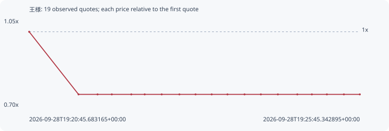

# 王様

**solana** / `B6TBmEJuS8QGJGcJG4V8DFzMdh944rF7TeEx9vrEBkj9`

[All tokens](README.md) · [Market window](../README.md)

## Native assessments

This contract is in the quote cohort; it has no native model assessment in this window.

## Series 7feb53d5f4ff33c9a394

Pool: `not supplied`

[Complete series](../series/solana/7feb53d5f4ff33c9a394.json)

Every dot is a captured quote. Lines connect observations; the curve ends at the last available quote.

| Peak | Final | Return | Maximum drawdown |
| ---: | ---: | ---: | ---: |
| 1.0000x | 0.7469x | -25.31% | 25.31% |

### Complete quote timeline

| Time (UTC) | Price (USD) | Multiple | Evidence |
| --- | ---: | ---: | --- |
| 2026-09-28T19:20:45.683165+00:00 | 4.63775e-06 | 1.0000x | `capture:17963a37-fd65-46b6-8e1c-350082721f8c:rank:94` |
| 2026-09-28T19:21:30.402460+00:00 | 3.46409e-06 | 0.7469x | `capture:d926629b-2050-4e50-a602-1638c6205870:rank:70` |
| 2026-09-28T19:21:47.649380+00:00 | 3.46409e-06 | 0.7469x | `capture:0799ec6d-0e89-46b5-ae88-5695bf6c5fc3:rank:74` |
| 2026-09-28T19:22:00.569928+00:00 | 3.46409e-06 | 0.7469x | `capture:263cda40-4b31-4b2d-b168-fa4310edb46d:rank:74` |
| 2026-09-28T19:22:18.240717+00:00 | 3.46409e-06 | 0.7469x | `capture:546b2c55-1845-4da7-bc9c-4439cd0ccdba:rank:71` |
| 2026-09-28T19:22:30.371968+00:00 | 3.46409e-06 | 0.7469x | `capture:507d17cb-af67-4a81-a2b2-d5ddfbc40021:rank:73` |
| 2026-09-28T19:22:45.783808+00:00 | 3.46409e-06 | 0.7469x | `capture:9558d322-c429-480b-885f-82f4481c8506:rank:74` |
| 2026-09-28T19:23:01.833252+00:00 | 3.46409e-06 | 0.7469x | `capture:c5462412-2da1-4432-8949-8fcd1492c57f:rank:73` |
| 2026-09-28T19:23:16.460099+00:00 | 3.46409e-06 | 0.7469x | `capture:2d456a2a-6755-4e1d-9a80-b6e3b2d44ec1:rank:74` |
| 2026-09-28T19:23:31.092727+00:00 | 3.46409e-06 | 0.7469x | `capture:0e687519-8b01-4d7e-b48c-e2ec34135d17:rank:73` |
| 2026-09-28T19:23:45.375171+00:00 | 3.46409e-06 | 0.7469x | `capture:1b404fa0-870b-4e7c-bafd-c3ef241c5093:rank:74` |
| 2026-09-28T19:24:00.852400+00:00 | 3.46409e-06 | 0.7469x | `capture:5205c587-4734-452c-b758-46c4814dded1:rank:70` |
| 2026-09-28T19:24:15.655418+00:00 | 3.46409e-06 | 0.7469x | `capture:5b9df0f6-51c0-4dbb-9de7-7df7a46bfee0:rank:73` |
| 2026-09-28T19:24:31.056437+00:00 | 3.46409e-06 | 0.7469x | `capture:971b5dda-397d-4fe7-b49e-94713bb088df:rank:73` |
| 2026-09-28T19:24:48.687179+00:00 | 3.46409e-06 | 0.7469x | `capture:feb72cbd-a170-4ba3-8a11-eb1df1686719:rank:72` |
| 2026-09-28T19:25:01.877958+00:00 | 3.46409e-06 | 0.7469x | `capture:fd6d01ae-d246-439e-ac58-27ae75880eb9:rank:71` |
| 2026-09-28T19:25:15.488701+00:00 | 3.46409e-06 | 0.7469x | `capture:b8fee87c-9981-475c-930b-99c255910a9f:rank:70` |
| 2026-09-28T19:25:30.900173+00:00 | 3.46409e-06 | 0.7469x | `capture:7f757769-25c3-429a-81d0-c6b2ee45ee15:rank:73` |
| 2026-09-28T19:25:45.342895+00:00 | 3.46409e-06 | 0.7469x | `capture:0ca3656d-ce8c-444b-8f77-acf34c08a1f4:rank:81` |

### Exit-policy timeline

Calculated from captured quotes under the window policy. Native assessments are linked separately above.

| Time (UTC) | Action | Price (USD) | Evidence |
| --- | --- | ---: | --- |
| 2026-09-28T19:20:45.683165+00:00 | BUY | 4.63775e-06 | `capture:17963a37-fd65-46b6-8e1c-350082721f8c:rank:94` |
| 2026-09-28T19:21:30.402460+00:00 | SL | 3.46409e-06 | `capture:d926629b-2050-4e50-a602-1638c6205870:rank:70` |
