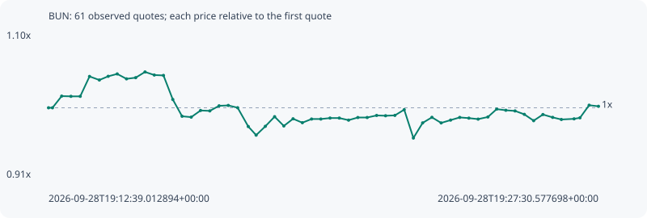

# BUN

**robinhood** / `0x07ebb29a38fbcb41563817e5e19f2cec619c90d2`

[All tokens](README.md) · [Market window](../README.md)

## Native assessments

This contract is in the quote cohort; it has no native model assessment in this window.

## Series 18c69cc8f4cb43b63665

Pool: `not supplied`

[Complete series](../series/robinhood/18c69cc8f4cb43b63665.json)

Every dot is a captured quote. Lines connect observations; the curve ends at the last available quote.

| Peak | Final | Return | Maximum drawdown |
| ---: | ---: | ---: | ---: |
| 1.0452x | 1.0019x | +0.19% | 7.97% |

### Complete quote timeline

| Time (UTC) | Price (USD) | Multiple | Evidence |
| --- | ---: | ---: | --- |
| 2026-09-28T19:12:39.012894+00:00 | 0.103202 | 1.0000x | `capture:fe8ad944-154e-4481-bd56-8ab821bfbfe1:rank:5` |
| 2026-09-28T19:12:45.402569+00:00 | 0.103202 | 1.0000x | `capture:8deb508c-ea33-4c21-a5c5-f0991dd6dcac:rank:5` |
| 2026-09-28T19:13:00.335966+00:00 | 0.104721 | 1.0147x | `capture:ee3ee7f8-576f-4c42-a7e0-cd9f917fdb36:rank:5` |
| 2026-09-28T19:13:15.331879+00:00 | 0.104692 | 1.0144x | `capture:c384257a-4501-4701-8a0c-a6b08fe727d5:rank:5` |
| 2026-09-28T19:13:30.402311+00:00 | 0.104692 | 1.0144x | `capture:44090e9e-d515-41c4-a78f-893390e6f2b0:rank:6` |
| 2026-09-28T19:13:45.493213+00:00 | 0.107282 | 1.0395x | `capture:52264519-193b-4508-b560-e9ee4e3e0963:rank:6` |
| 2026-09-28T19:14:01.407289+00:00 | 0.106816 | 1.0350x | `capture:0a62cce6-2c27-4761-80c1-feb9130a0c83:rank:6` |
| 2026-09-28T19:14:15.755233+00:00 | 0.107299 | 1.0397x | `capture:09651124-e158-421c-bcdc-cb2310b48412:rank:7` |
| 2026-09-28T19:14:30.367936+00:00 | 0.107607 | 1.0427x | `capture:7a0b9f45-7248-4af6-b349-4bf6d5ef81be:rank:7` |
| 2026-09-28T19:14:45.422215+00:00 | 0.106968 | 1.0365x | `capture:bf6e34c4-c499-472e-8e2b-ebbb151300e2:rank:7` |
| 2026-09-28T19:15:00.325882+00:00 | 0.107122 | 1.0380x | `capture:663c0420-2b9e-4a94-998b-531fa9202dee:rank:8` |
| 2026-09-28T19:15:15.449577+00:00 | 0.107866 | 1.0452x | `capture:14452070-ab94-45a0-af6d-e6c54082daec:rank:8` |
| 2026-09-28T19:15:30.501058+00:00 | 0.107463 | 1.0413x | `capture:4e680297-1e75-418b-b818-8b2903e8b923:rank:8` |
| 2026-09-28T19:15:45.353664+00:00 | 0.107414 | 1.0408x | `capture:b9051b67-24e1-4469-9f82-bc08bd56807d:rank:8` |
| 2026-09-28T19:16:00.473367+00:00 | 0.104283 | 1.0105x | `capture:cd404827-1073-4901-b09c-82ef1488855b:rank:7` |
| 2026-09-28T19:16:15.518445+00:00 | 0.102098 | 0.9893x | `capture:c193221c-c80a-4a3b-ad88-59f12dcb1689:rank:7` |
| 2026-09-28T19:16:30.344303+00:00 | 0.101985 | 0.9882x | `capture:18d587e7-b24d-4b8d-82f1-0ac2903a3303:rank:7` |
| 2026-09-28T19:16:45.486467+00:00 | 0.102852 | 0.9966x | `capture:4ca26bf7-9d1e-455b-a63e-1b5df831b997:rank:7` |
| 2026-09-28T19:17:00.510014+00:00 | 0.102798 | 0.9961x | `capture:d9309a4d-09d7-45ee-91ce-c4a055e8faac:rank:8` |
| 2026-09-28T19:17:15.523068+00:00 | 0.103459 | 1.0025x | `capture:333d670d-dbd3-4656-95f9-1bc781b271db:rank:8` |
| 2026-09-28T19:17:30.451540+00:00 | 0.103509 | 1.0030x | `capture:e161007c-0751-46e4-acc9-c8e28cd7190a:rank:8` |
| 2026-09-28T19:17:45.582227+00:00 | 0.103211 | 1.0001x | `capture:a3f98285-516a-4bd4-b2c4-63596c968a6b:rank:8` |
| 2026-09-28T19:18:02.849542+00:00 | 0.100763 | 0.9764x | `capture:53a348cd-74d6-4031-ba2b-02d70c63e42b:rank:8` |
| 2026-09-28T19:18:15.585380+00:00 | 0.0996404 | 0.9655x | `capture:ea19027f-d2c1-43cc-973f-0d8eb46ed64e:rank:8` |
| 2026-09-28T19:18:30.489414+00:00 | 0.10079 | 0.9766x | `capture:c5cd70df-4ca4-4388-b3c5-f977fa86f8a2:rank:7` |
| 2026-09-28T19:18:45.550203+00:00 | 0.102045 | 0.9888x | `capture:728d4974-5fe3-40a8-8e99-2139c59da3e3:rank:5` |
| 2026-09-28T19:19:00.487408+00:00 | 0.100837 | 0.9771x | `capture:297e4fae-3bb5-49eb-b490-a4f34898851c:rank:6` |
| 2026-09-28T19:19:15.451095+00:00 | 0.101771 | 0.9861x | `capture:0bcc0576-3637-4b2c-b0e4-f9e05871b187:rank:6` |
| 2026-09-28T19:19:30.512866+00:00 | 0.10126 | 0.9812x | `capture:bb499bdc-159a-4072-a450-312045f32cef:rank:6` |
| 2026-09-28T19:19:45.438706+00:00 | 0.101738 | 0.9858x | `capture:59b12f7b-2112-42c7-834a-a2eb9bcaee3d:rank:7` |
| 2026-09-28T19:20:00.494705+00:00 | 0.101738 | 0.9858x | `capture:5b06d6b3-9eca-4487-82fb-6b28820c37d9:rank:8` |
| 2026-09-28T19:20:15.393373+00:00 | 0.101865 | 0.9870x | `capture:17802da9-7cee-48c3-9f5b-5829781be3f6:rank:9` |
| 2026-09-28T19:20:30.417446+00:00 | 0.101865 | 0.9870x | `capture:f2fe9ac4-89a0-4ad3-8f15-5a70d7e1d5f7:rank:9` |
| 2026-09-28T19:20:45.464282+00:00 | 0.101593 | 0.9844x | `capture:26559b75-812f-4386-982b-eba5073faf44:rank:9` |
| 2026-09-28T19:21:00.449260+00:00 | 0.101936 | 0.9877x | `capture:186445b2-8971-4639-85b9-26b2e8fb9d2c:rank:9` |
| 2026-09-28T19:21:15.606838+00:00 | 0.101936 | 0.9877x | `capture:c2a8ab31-038e-42f4-8e33-852fee1b9a24:rank:10` |
| 2026-09-28T19:21:30.959683+00:00 | 0.102206 | 0.9903x | `capture:300e0f35-12d4-46a9-a17e-17adbe8e1059:rank:10` |
| 2026-09-28T19:21:45.420062+00:00 | 0.102167 | 0.9900x | `capture:ec22b61b-732a-44d2-be85-c577051928eb:rank:9` |
| 2026-09-28T19:22:00.489634+00:00 | 0.102211 | 0.9904x | `capture:d6c64542-18c5-48a0-a6c9-f0e2a9c54b41:rank:9` |
| 2026-09-28T19:22:15.632268+00:00 | 0.102958 | 0.9976x | `capture:13e6d33e-e854-4b87-b3da-49aedec6950e:rank:9` |
| 2026-09-28T19:22:30.535979+00:00 | 0.0992719 | 0.9619x | `capture:091fb4d2-10fc-4d5f-9c22-af9f55e90e4a:rank:8` |
| 2026-09-28T19:22:45.520851+00:00 | 0.101236 | 0.9809x | `capture:128617a9-4055-4a8d-8b04-c8876bad9c70:rank:8` |
| 2026-09-28T19:23:00.594785+00:00 | 0.101959 | 0.9880x | `capture:b6c633f1-3960-4db3-a2ca-34618f913368:rank:7` |
| 2026-09-28T19:23:15.534636+00:00 | 0.101233 | 0.9809x | `capture:d5a0d1a4-a366-4985-80da-e34160e2f58c:rank:8` |
| 2026-09-28T19:23:30.815940+00:00 | 0.101598 | 0.9845x | `capture:c6f23ed9-c47c-4f73-bf08-86a494a11aa2:rank:9` |
| 2026-09-28T19:23:45.643860+00:00 | 0.101948 | 0.9878x | `capture:0b8bbeb9-cbaa-4cb2-a853-2bb146bd23e5:rank:9` |
| 2026-09-28T19:24:00.467430+00:00 | 0.101857 | 0.9870x | `capture:4a231962-827e-445d-ab7d-bb974bfc841b:rank:9` |
| 2026-09-28T19:24:15.505143+00:00 | 0.101726 | 0.9857x | `capture:b7273a78-8f87-4dcc-877e-f47f549e0fe8:rank:9` |
| 2026-09-28T19:24:31.344409+00:00 | 0.102005 | 0.9884x | `capture:85f4db1c-c852-45c3-99aa-4320f3839031:rank:8` |
| 2026-09-28T19:24:45.576445+00:00 | 0.10303 | 0.9983x | `capture:da07dfaa-56d9-4a51-99df-1ad071803eb0:rank:9` |
| 2026-09-28T19:25:00.412700+00:00 | 0.102879 | 0.9969x | `capture:1dec2f8f-4694-4c32-8be8-eeec3980c853:rank:9` |
| 2026-09-28T19:25:15.316372+00:00 | 0.102793 | 0.9960x | `capture:52eaf5a3-351e-4c29-b00b-a167107703e3:rank:9` |
| 2026-09-28T19:25:30.354898+00:00 | 0.102348 | 0.9917x | `capture:d70b1f6a-3ec3-4ec2-8c88-db476beae4f9:rank:10` |
| 2026-09-28T19:25:45.483791+00:00 | 0.101524 | 0.9837x | `capture:ebb21e05-3dc6-4a8f-a800-fa79ba147200:rank:10` |
| 2026-09-28T19:26:00.522113+00:00 | 0.102325 | 0.9915x | `capture:a33301e4-8f37-4fb5-af69-629635c54fe6:rank:9` |
| 2026-09-28T19:26:16.279485+00:00 | 0.101954 | 0.9879x | `capture:085b2ea9-3985-4608-a1cd-1eddc6b16122:rank:8` |
| 2026-09-28T19:26:30.447392+00:00 | 0.101679 | 0.9852x | `capture:36fd4b46-5420-443d-b1ed-b86b98706671:rank:7` |
| 2026-09-28T19:26:51.039990+00:00 | 0.101765 | 0.9861x | `capture:653b62fa-7a58-45fd-95e9-3b36912dc139:rank:7` |
| 2026-09-28T19:27:00.598930+00:00 | 0.101898 | 0.9874x | `capture:8041f6b0-6188-445c-83ef-3a6fb7daf321:rank:7` |
| 2026-09-28T19:27:15.438746+00:00 | 0.103538 | 1.0033x | `capture:b4c48612-e04d-4782-96a6-e80c2955d3b9:rank:7` |
| 2026-09-28T19:27:30.577698+00:00 | 0.103394 | 1.0019x | `capture:ff6b3949-9c3c-4cdf-b48c-d4010666c140:rank:7` |

### Exit-policy timeline

Calculated from captured quotes under the window policy. Native assessments are linked separately above.

| Time (UTC) | Action | Price (USD) | Evidence |
| --- | --- | ---: | --- |
| 2026-09-28T19:12:39.012894+00:00 | BUY | 0.103202 | `capture:fe8ad944-154e-4481-bd56-8ab821bfbfe1:rank:5` |
| 2026-09-28T19:12:45.402569+00:00 | HOLD | 0.103202 | `capture:8deb508c-ea33-4c21-a5c5-f0991dd6dcac:rank:5` |
| 2026-09-28T19:13:00.335966+00:00 | HOLD | 0.104721 | `capture:ee3ee7f8-576f-4c42-a7e0-cd9f917fdb36:rank:5` |
| 2026-09-28T19:13:15.331879+00:00 | HOLD | 0.104692 | `capture:c384257a-4501-4701-8a0c-a6b08fe727d5:rank:5` |
| 2026-09-28T19:13:30.402311+00:00 | HOLD | 0.104692 | `capture:44090e9e-d515-41c4-a78f-893390e6f2b0:rank:6` |
| 2026-09-28T19:13:45.493213+00:00 | HOLD | 0.107282 | `capture:52264519-193b-4508-b560-e9ee4e3e0963:rank:6` |
| 2026-09-28T19:14:01.407289+00:00 | HOLD | 0.106816 | `capture:0a62cce6-2c27-4761-80c1-feb9130a0c83:rank:6` |
| 2026-09-28T19:14:15.755233+00:00 | HOLD | 0.107299 | `capture:09651124-e158-421c-bcdc-cb2310b48412:rank:7` |
| 2026-09-28T19:14:30.367936+00:00 | HOLD | 0.107607 | `capture:7a0b9f45-7248-4af6-b349-4bf6d5ef81be:rank:7` |
| 2026-09-28T19:14:45.422215+00:00 | HOLD | 0.106968 | `capture:bf6e34c4-c499-472e-8e2b-ebbb151300e2:rank:7` |
| 2026-09-28T19:15:00.325882+00:00 | HOLD | 0.107122 | `capture:663c0420-2b9e-4a94-998b-531fa9202dee:rank:8` |
| 2026-09-28T19:15:15.449577+00:00 | HOLD | 0.107866 | `capture:14452070-ab94-45a0-af6d-e6c54082daec:rank:8` |
| 2026-09-28T19:15:30.501058+00:00 | HOLD | 0.107463 | `capture:4e680297-1e75-418b-b818-8b2903e8b923:rank:8` |
| 2026-09-28T19:15:45.353664+00:00 | HOLD | 0.107414 | `capture:b9051b67-24e1-4469-9f82-bc08bd56807d:rank:8` |
| 2026-09-28T19:16:00.473367+00:00 | HOLD | 0.104283 | `capture:cd404827-1073-4901-b09c-82ef1488855b:rank:7` |
| 2026-09-28T19:16:15.518445+00:00 | HOLD | 0.102098 | `capture:c193221c-c80a-4a3b-ad88-59f12dcb1689:rank:7` |
| 2026-09-28T19:16:30.344303+00:00 | HOLD | 0.101985 | `capture:18d587e7-b24d-4b8d-82f1-0ac2903a3303:rank:7` |
| 2026-09-28T19:16:45.486467+00:00 | HOLD | 0.102852 | `capture:4ca26bf7-9d1e-455b-a63e-1b5df831b997:rank:7` |
| 2026-09-28T19:17:00.510014+00:00 | HOLD | 0.102798 | `capture:d9309a4d-09d7-45ee-91ce-c4a055e8faac:rank:8` |
| 2026-09-28T19:17:15.523068+00:00 | HOLD | 0.103459 | `capture:333d670d-dbd3-4656-95f9-1bc781b271db:rank:8` |
| 2026-09-28T19:17:30.451540+00:00 | HOLD | 0.103509 | `capture:e161007c-0751-46e4-acc9-c8e28cd7190a:rank:8` |
| 2026-09-28T19:17:45.582227+00:00 | HOLD | 0.103211 | `capture:a3f98285-516a-4bd4-b2c4-63596c968a6b:rank:8` |
| 2026-09-28T19:18:02.849542+00:00 | HOLD | 0.100763 | `capture:53a348cd-74d6-4031-ba2b-02d70c63e42b:rank:8` |
| 2026-09-28T19:18:15.585380+00:00 | HOLD | 0.0996404 | `capture:ea19027f-d2c1-43cc-973f-0d8eb46ed64e:rank:8` |
| 2026-09-28T19:18:30.489414+00:00 | HOLD | 0.10079 | `capture:c5cd70df-4ca4-4388-b3c5-f977fa86f8a2:rank:7` |
| 2026-09-28T19:18:45.550203+00:00 | HOLD | 0.102045 | `capture:728d4974-5fe3-40a8-8e99-2139c59da3e3:rank:5` |
| 2026-09-28T19:19:00.487408+00:00 | HOLD | 0.100837 | `capture:297e4fae-3bb5-49eb-b490-a4f34898851c:rank:6` |
| 2026-09-28T19:19:15.451095+00:00 | HOLD | 0.101771 | `capture:0bcc0576-3637-4b2c-b0e4-f9e05871b187:rank:6` |
| 2026-09-28T19:19:30.512866+00:00 | HOLD | 0.10126 | `capture:bb499bdc-159a-4072-a450-312045f32cef:rank:6` |
| 2026-09-28T19:19:45.438706+00:00 | HOLD | 0.101738 | `capture:59b12f7b-2112-42c7-834a-a2eb9bcaee3d:rank:7` |
| 2026-09-28T19:20:00.494705+00:00 | HOLD | 0.101738 | `capture:5b06d6b3-9eca-4487-82fb-6b28820c37d9:rank:8` |
| 2026-09-28T19:20:15.393373+00:00 | HOLD | 0.101865 | `capture:17802da9-7cee-48c3-9f5b-5829781be3f6:rank:9` |
| 2026-09-28T19:20:30.417446+00:00 | HOLD | 0.101865 | `capture:f2fe9ac4-89a0-4ad3-8f15-5a70d7e1d5f7:rank:9` |
| 2026-09-28T19:20:45.464282+00:00 | HOLD | 0.101593 | `capture:26559b75-812f-4386-982b-eba5073faf44:rank:9` |
| 2026-09-28T19:21:00.449260+00:00 | HOLD | 0.101936 | `capture:186445b2-8971-4639-85b9-26b2e8fb9d2c:rank:9` |
| 2026-09-28T19:21:15.606838+00:00 | HOLD | 0.101936 | `capture:c2a8ab31-038e-42f4-8e33-852fee1b9a24:rank:10` |
| 2026-09-28T19:21:30.959683+00:00 | HOLD | 0.102206 | `capture:300e0f35-12d4-46a9-a17e-17adbe8e1059:rank:10` |
| 2026-09-28T19:21:45.420062+00:00 | HOLD | 0.102167 | `capture:ec22b61b-732a-44d2-be85-c577051928eb:rank:9` |
| 2026-09-28T19:22:00.489634+00:00 | HOLD | 0.102211 | `capture:d6c64542-18c5-48a0-a6c9-f0e2a9c54b41:rank:9` |
| 2026-09-28T19:22:15.632268+00:00 | HOLD | 0.102958 | `capture:13e6d33e-e854-4b87-b3da-49aedec6950e:rank:9` |
| 2026-09-28T19:22:30.535979+00:00 | HOLD | 0.0992719 | `capture:091fb4d2-10fc-4d5f-9c22-af9f55e90e4a:rank:8` |
| 2026-09-28T19:22:45.520851+00:00 | HOLD | 0.101236 | `capture:128617a9-4055-4a8d-8b04-c8876bad9c70:rank:8` |
| 2026-09-28T19:23:00.594785+00:00 | HOLD | 0.101959 | `capture:b6c633f1-3960-4db3-a2ca-34618f913368:rank:7` |
| 2026-09-28T19:23:15.534636+00:00 | HOLD | 0.101233 | `capture:d5a0d1a4-a366-4985-80da-e34160e2f58c:rank:8` |
| 2026-09-28T19:23:30.815940+00:00 | HOLD | 0.101598 | `capture:c6f23ed9-c47c-4f73-bf08-86a494a11aa2:rank:9` |
| 2026-09-28T19:23:45.643860+00:00 | HOLD | 0.101948 | `capture:0b8bbeb9-cbaa-4cb2-a853-2bb146bd23e5:rank:9` |
| 2026-09-28T19:24:00.467430+00:00 | HOLD | 0.101857 | `capture:4a231962-827e-445d-ab7d-bb974bfc841b:rank:9` |
| 2026-09-28T19:24:15.505143+00:00 | HOLD | 0.101726 | `capture:b7273a78-8f87-4dcc-877e-f47f549e0fe8:rank:9` |
| 2026-09-28T19:24:31.344409+00:00 | HOLD | 0.102005 | `capture:85f4db1c-c852-45c3-99aa-4320f3839031:rank:8` |
| 2026-09-28T19:24:45.576445+00:00 | HOLD | 0.10303 | `capture:da07dfaa-56d9-4a51-99df-1ad071803eb0:rank:9` |
| 2026-09-28T19:25:00.412700+00:00 | HOLD | 0.102879 | `capture:1dec2f8f-4694-4c32-8be8-eeec3980c853:rank:9` |
| 2026-09-28T19:25:15.316372+00:00 | HOLD | 0.102793 | `capture:52eaf5a3-351e-4c29-b00b-a167107703e3:rank:9` |
| 2026-09-28T19:25:30.354898+00:00 | HOLD | 0.102348 | `capture:d70b1f6a-3ec3-4ec2-8c88-db476beae4f9:rank:10` |
| 2026-09-28T19:25:45.483791+00:00 | HOLD | 0.101524 | `capture:ebb21e05-3dc6-4a8f-a800-fa79ba147200:rank:10` |
| 2026-09-28T19:26:00.522113+00:00 | HOLD | 0.102325 | `capture:a33301e4-8f37-4fb5-af69-629635c54fe6:rank:9` |
| 2026-09-28T19:26:16.279485+00:00 | HOLD | 0.101954 | `capture:085b2ea9-3985-4608-a1cd-1eddc6b16122:rank:8` |
| 2026-09-28T19:26:30.447392+00:00 | HOLD | 0.101679 | `capture:36fd4b46-5420-443d-b1ed-b86b98706671:rank:7` |
| 2026-09-28T19:26:51.039990+00:00 | HOLD | 0.101765 | `capture:653b62fa-7a58-45fd-95e9-3b36912dc139:rank:7` |
| 2026-09-28T19:27:00.598930+00:00 | HOLD | 0.101898 | `capture:8041f6b0-6188-445c-83ef-3a6fb7daf321:rank:7` |
| 2026-09-28T19:27:15.438746+00:00 | HOLD | 0.103538 | `capture:b4c48612-e04d-4782-96a6-e80c2955d3b9:rank:7` |
| 2026-09-28T19:27:30.577698+00:00 | HOLD | 0.103394 | `capture:ff6b3949-9c3c-4cdf-b48c-d4010666c140:rank:7` |
