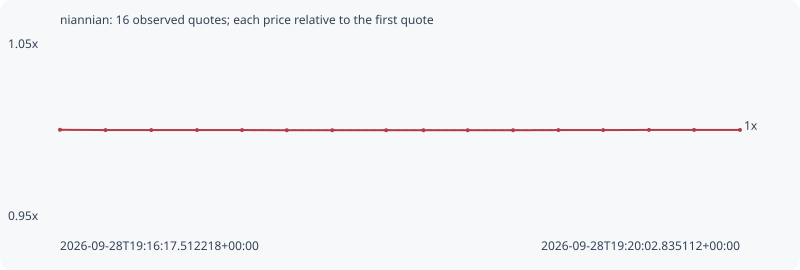

# niannian

**bsc** / `0xcb74970b86b9abf3d75748eb2c3bff53e5cd7777`

[All tokens](README.md) · [Market window](../README.md)

## Native assessments

This contract is in the quote cohort; it has no native model assessment in this window.

## Series 6e493cda3276293f2fbf

Pool: `not supplied`

[Complete series](../series/bsc/6e493cda3276293f2fbf.json)

Every dot is a captured quote. Lines connect observations; the curve ends at the last available quote.

| Peak | Final | Return | Maximum drawdown |
| ---: | ---: | ---: | ---: |
| 1.0000x | 0.9999x | -0.01% | 0.03% |

### Complete quote timeline

| Time (UTC) | Price (USD) | Multiple | Evidence |
| --- | ---: | ---: | --- |
| 2026-09-28T19:16:17.512218+00:00 | 1.15661e-05 | 1.0000x | `capture:a4477278-80c9-4a7a-9a8f-66687623072c:rank:38` |
| 2026-09-28T19:16:32.607943+00:00 | 1.15642e-05 | 0.9998x | `capture:4487eb62-651f-462e-aece-4003e9e61067:rank:37` |
| 2026-09-28T19:16:47.751534+00:00 | 1.15642e-05 | 0.9998x | `capture:39d9c9d0-d8a7-439e-86b7-5fff162807b9:rank:40` |
| 2026-09-28T19:17:02.908604+00:00 | 1.15642e-05 | 0.9998x | `capture:16fde76e-cae4-4138-b96e-57b291931df8:rank:43` |
| 2026-09-28T19:17:17.816055+00:00 | 1.15642e-05 | 0.9998x | `capture:7f9359fa-2f23-4e78-9500-f9df7d85a6b2:rank:44` |
| 2026-09-28T19:17:32.654140+00:00 | 1.15632e-05 | 0.9997x | `capture:4e95b3e2-d20d-4729-ac41-d7699561b97b:rank:45` |
| 2026-09-28T19:17:47.717594+00:00 | 1.15632e-05 | 0.9997x | `capture:2cc72c7e-c2ae-4eb2-929b-e80f3d8c4e15:rank:42` |
| 2026-09-28T19:18:05.582121+00:00 | 1.15632e-05 | 0.9997x | `capture:07127a86-393c-4e05-bde5-d28a70a854fb:rank:41` |
| 2026-09-28T19:18:17.953086+00:00 | 1.15632e-05 | 0.9997x | `capture:ca903b0a-a9a8-4246-873f-5115402fbf9c:rank:39` |
| 2026-09-28T19:18:32.607444+00:00 | 1.15632e-05 | 0.9997x | `capture:86009bbc-85b0-465e-8657-55be8d6c15de:rank:38` |
| 2026-09-28T19:18:47.632598+00:00 | 1.15632e-05 | 0.9997x | `capture:bfa4352f-2279-41ec-a6fd-d3e101a21181:rank:36` |
| 2026-09-28T19:19:02.666276+00:00 | 1.15641e-05 | 0.9998x | `capture:6fe1da90-a254-48b3-b112-ab24c6060e81:rank:33` |
| 2026-09-28T19:19:17.488471+00:00 | 1.15641e-05 | 0.9998x | `capture:b87f439a-4825-4a6f-b17c-0b78464d9310:rank:39` |
| 2026-09-28T19:19:32.672995+00:00 | 1.15651e-05 | 0.9999x | `capture:ceae4194-4b79-45b3-9a66-758dd19e2a7b:rank:39` |
| 2026-09-28T19:19:47.615151+00:00 | 1.15651e-05 | 0.9999x | `capture:0dedf968-cc48-4422-8bbf-180ff2103dbf:rank:37` |
| 2026-09-28T19:20:02.835112+00:00 | 1.15651e-05 | 0.9999x | `capture:adbb19f8-5a81-4d70-8990-a6ffd414f250:rank:41` |

### Exit-policy timeline

Calculated from captured quotes under the window policy. Native assessments are linked separately above.

| Time (UTC) | Action | Price (USD) | Evidence |
| --- | --- | ---: | --- |
| 2026-09-28T19:16:17.512218+00:00 | BUY | 1.15661e-05 | `capture:a4477278-80c9-4a7a-9a8f-66687623072c:rank:38` |
| 2026-09-28T19:16:32.607943+00:00 | HOLD | 1.15642e-05 | `capture:4487eb62-651f-462e-aece-4003e9e61067:rank:37` |
| 2026-09-28T19:16:47.751534+00:00 | HOLD | 1.15642e-05 | `capture:39d9c9d0-d8a7-439e-86b7-5fff162807b9:rank:40` |
| 2026-09-28T19:17:02.908604+00:00 | HOLD | 1.15642e-05 | `capture:16fde76e-cae4-4138-b96e-57b291931df8:rank:43` |
| 2026-09-28T19:17:17.816055+00:00 | HOLD | 1.15642e-05 | `capture:7f9359fa-2f23-4e78-9500-f9df7d85a6b2:rank:44` |
| 2026-09-28T19:17:32.654140+00:00 | HOLD | 1.15632e-05 | `capture:4e95b3e2-d20d-4729-ac41-d7699561b97b:rank:45` |
| 2026-09-28T19:17:47.717594+00:00 | HOLD | 1.15632e-05 | `capture:2cc72c7e-c2ae-4eb2-929b-e80f3d8c4e15:rank:42` |
| 2026-09-28T19:18:05.582121+00:00 | HOLD | 1.15632e-05 | `capture:07127a86-393c-4e05-bde5-d28a70a854fb:rank:41` |
| 2026-09-28T19:18:17.953086+00:00 | HOLD | 1.15632e-05 | `capture:ca903b0a-a9a8-4246-873f-5115402fbf9c:rank:39` |
| 2026-09-28T19:18:32.607444+00:00 | HOLD | 1.15632e-05 | `capture:86009bbc-85b0-465e-8657-55be8d6c15de:rank:38` |
| 2026-09-28T19:18:47.632598+00:00 | HOLD | 1.15632e-05 | `capture:bfa4352f-2279-41ec-a6fd-d3e101a21181:rank:36` |
| 2026-09-28T19:19:02.666276+00:00 | HOLD | 1.15641e-05 | `capture:6fe1da90-a254-48b3-b112-ab24c6060e81:rank:33` |
| 2026-09-28T19:19:17.488471+00:00 | HOLD | 1.15641e-05 | `capture:b87f439a-4825-4a6f-b17c-0b78464d9310:rank:39` |
| 2026-09-28T19:19:32.672995+00:00 | HOLD | 1.15651e-05 | `capture:ceae4194-4b79-45b3-9a66-758dd19e2a7b:rank:39` |
| 2026-09-28T19:19:47.615151+00:00 | HOLD | 1.15651e-05 | `capture:0dedf968-cc48-4422-8bbf-180ff2103dbf:rank:37` |
| 2026-09-28T19:20:02.835112+00:00 | HOLD | 1.15651e-05 | `capture:adbb19f8-5a81-4d70-8990-a6ffd414f250:rank:41` |
