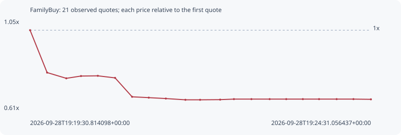

# FamilyBuy

**solana** / `EfSCK9ymY4zRVeNpUoCTnhPpicx8wd8A59H5HuJZpump`

[All tokens](README.md) · [Market window](../README.md)

## Native assessments

This contract is in the quote cohort; it has no native model assessment in this window.

## Series 3fb6b771c9249bb92f06

Pool: `not supplied`

[Complete series](../series/solana/3fb6b771c9249bb92f06.json)

Every dot is a captured quote. Lines connect observations; the curve ends at the last available quote.

| Peak | Final | Return | Maximum drawdown |
| ---: | ---: | ---: | ---: |
| 1.0000x | 0.6607x | -33.93% | 34.17% |

### Complete quote timeline

| Time (UTC) | Price (USD) | Multiple | Evidence |
| --- | ---: | ---: | --- |
| 2026-09-28T19:19:30.814098+00:00 | 8.46049e-06 | 1.0000x | `capture:b25d90dc-c8db-4388-8a2b-d06541e5320f:rank:96` |
| 2026-09-28T19:19:45.817199+00:00 | 6.70078e-06 | 0.7920x | `capture:722d1b7b-ef4f-4ac5-883c-0557bae2b60b:rank:77` |
| 2026-09-28T19:20:02.715590+00:00 | 6.46213e-06 | 0.7638x | `capture:60ff17d8-3b18-4f61-9bc7-006afd324cf2:rank:71` |
| 2026-09-28T19:20:15.699547+00:00 | 6.55686e-06 | 0.7750x | `capture:10a94828-637f-4580-a9f7-2fbd34d8589a:rank:72` |
| 2026-09-28T19:20:30.480194+00:00 | 6.56605e-06 | 0.7761x | `capture:54722132-db1d-4a2b-8c1c-2b0e71d01430:rank:68` |
| 2026-09-28T19:20:45.683165+00:00 | 6.4802e-06 | 0.7659x | `capture:17963a37-fd65-46b6-8e1c-350082721f8c:rank:68` |
| 2026-09-28T19:21:00.690136+00:00 | 5.69452e-06 | 0.6731x | `capture:f2ff842d-38e9-4cbe-a281-98c17d5a5672:rank:64` |
| 2026-09-28T19:21:15.372716+00:00 | 5.66008e-06 | 0.6690x | `capture:a923b968-a768-495e-ae33-6de2042c551f:rank:62` |
| 2026-09-28T19:21:30.402460+00:00 | 5.62222e-06 | 0.6645x | `capture:d926629b-2050-4e50-a602-1638c6205870:rank:56` |
| 2026-09-28T19:21:47.649380+00:00 | 5.56988e-06 | 0.6583x | `capture:0799ec6d-0e89-46b5-ae88-5695bf6c5fc3:rank:56` |
| 2026-09-28T19:22:00.569928+00:00 | 5.56988e-06 | 0.6583x | `capture:263cda40-4b31-4b2d-b168-fa4310edb46d:rank:57` |
| 2026-09-28T19:22:18.240717+00:00 | 5.57731e-06 | 0.6592x | `capture:546b2c55-1845-4da7-bc9c-4439cd0ccdba:rank:52` |
| 2026-09-28T19:22:30.371968+00:00 | 5.59899e-06 | 0.6618x | `capture:507d17cb-af67-4a81-a2b2-d5ddfbc40021:rank:53` |
| 2026-09-28T19:22:45.783808+00:00 | 5.59899e-06 | 0.6618x | `capture:9558d322-c429-480b-885f-82f4481c8506:rank:57` |
| 2026-09-28T19:23:01.833252+00:00 | 5.59899e-06 | 0.6618x | `capture:c5462412-2da1-4432-8949-8fcd1492c57f:rank:54` |
| 2026-09-28T19:23:16.460099+00:00 | 5.59899e-06 | 0.6618x | `capture:2d456a2a-6755-4e1d-9a80-b6e3b2d44ec1:rank:56` |
| 2026-09-28T19:23:31.092727+00:00 | 5.59899e-06 | 0.6618x | `capture:0e687519-8b01-4d7e-b48c-e2ec34135d17:rank:52` |
| 2026-09-28T19:23:45.375171+00:00 | 5.59899e-06 | 0.6618x | `capture:1b404fa0-870b-4e7c-bafd-c3ef241c5093:rank:53` |
| 2026-09-28T19:24:00.852400+00:00 | 5.59899e-06 | 0.6618x | `capture:5205c587-4734-452c-b758-46c4814dded1:rank:53` |
| 2026-09-28T19:24:15.655418+00:00 | 5.59899e-06 | 0.6618x | `capture:5b9df0f6-51c0-4dbb-9de7-7df7a46bfee0:rank:55` |
| 2026-09-28T19:24:31.056437+00:00 | 5.58995e-06 | 0.6607x | `capture:971b5dda-397d-4fe7-b49e-94713bb088df:rank:69` |

### Exit-policy timeline

Calculated from captured quotes under the window policy. Native assessments are linked separately above.

| Time (UTC) | Action | Price (USD) | Evidence |
| --- | --- | ---: | --- |
| 2026-09-28T19:19:30.814098+00:00 | BUY | 8.46049e-06 | `capture:b25d90dc-c8db-4388-8a2b-d06541e5320f:rank:96` |
| 2026-09-28T19:19:45.817199+00:00 | SL | 6.70078e-06 | `capture:722d1b7b-ef4f-4ac5-883c-0557bae2b60b:rank:77` |
