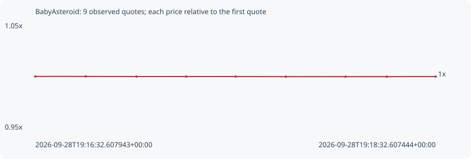

# BabyAsteroid

**bsc** / `0xfecbda1b8dbd73c4eea7843c04db816107fa6666`

[All tokens](README.md) · [Market window](../README.md)

## Native assessments

This contract is in the quote cohort; it has no native model assessment in this window.

## Series 44bf75469da609e867d8

Pool: `not supplied`

[Complete series](../series/bsc/44bf75469da609e867d8.json)

Every dot is a captured quote. Lines connect observations; the curve ends at the last available quote.

| Peak | Final | Return | Maximum drawdown |
| ---: | ---: | ---: | ---: |
| 1.0000x | 0.9999x | -0.01% | 0.02% |

### Complete quote timeline

| Time (UTC) | Price (USD) | Multiple | Evidence |
| --- | ---: | ---: | --- |
| 2026-09-28T19:16:32.607943+00:00 | 3.8601e-10 | 1.0000x | `capture:4487eb62-651f-462e-aece-4003e9e61067:rank:33` |
| 2026-09-28T19:16:47.751534+00:00 | 3.8601e-10 | 1.0000x | `capture:39d9c9d0-d8a7-439e-86b7-5fff162807b9:rank:34` |
| 2026-09-28T19:17:02.908604+00:00 | 3.85967e-10 | 0.9999x | `capture:16fde76e-cae4-4138-b96e-57b291931df8:rank:35` |
| 2026-09-28T19:17:17.816055+00:00 | 3.85967e-10 | 0.9999x | `capture:7f9359fa-2f23-4e78-9500-f9df7d85a6b2:rank:35` |
| 2026-09-28T19:17:32.654140+00:00 | 3.85967e-10 | 0.9999x | `capture:4e95b3e2-d20d-4729-ac41-d7699561b97b:rank:38` |
| 2026-09-28T19:17:47.717594+00:00 | 3.85931e-10 | 0.9998x | `capture:2cc72c7e-c2ae-4eb2-929b-e80f3d8c4e15:rank:32` |
| 2026-09-28T19:18:05.582121+00:00 | 3.85931e-10 | 0.9998x | `capture:07127a86-393c-4e05-bde5-d28a70a854fb:rank:33` |
| 2026-09-28T19:18:17.953086+00:00 | 3.85931e-10 | 0.9998x | `capture:ca903b0a-a9a8-4246-873f-5115402fbf9c:rank:34` |
| 2026-09-28T19:18:32.607444+00:00 | 3.85971e-10 | 0.9999x | `capture:86009bbc-85b0-465e-8657-55be8d6c15de:rank:33` |

### Exit-policy timeline

Calculated from captured quotes under the window policy. Native assessments are linked separately above.

| Time (UTC) | Action | Price (USD) | Evidence |
| --- | --- | ---: | --- |
| 2026-09-28T19:16:32.607943+00:00 | BUY | 3.8601e-10 | `capture:4487eb62-651f-462e-aece-4003e9e61067:rank:33` |
| 2026-09-28T19:16:47.751534+00:00 | HOLD | 3.8601e-10 | `capture:39d9c9d0-d8a7-439e-86b7-5fff162807b9:rank:34` |
| 2026-09-28T19:17:02.908604+00:00 | HOLD | 3.85967e-10 | `capture:16fde76e-cae4-4138-b96e-57b291931df8:rank:35` |
| 2026-09-28T19:17:17.816055+00:00 | HOLD | 3.85967e-10 | `capture:7f9359fa-2f23-4e78-9500-f9df7d85a6b2:rank:35` |
| 2026-09-28T19:17:32.654140+00:00 | HOLD | 3.85967e-10 | `capture:4e95b3e2-d20d-4729-ac41-d7699561b97b:rank:38` |
| 2026-09-28T19:17:47.717594+00:00 | HOLD | 3.85931e-10 | `capture:2cc72c7e-c2ae-4eb2-929b-e80f3d8c4e15:rank:32` |
| 2026-09-28T19:18:05.582121+00:00 | HOLD | 3.85931e-10 | `capture:07127a86-393c-4e05-bde5-d28a70a854fb:rank:33` |
| 2026-09-28T19:18:17.953086+00:00 | HOLD | 3.85931e-10 | `capture:ca903b0a-a9a8-4246-873f-5115402fbf9c:rank:34` |
| 2026-09-28T19:18:32.607444+00:00 | HOLD | 3.85971e-10 | `capture:86009bbc-85b0-465e-8657-55be8d6c15de:rank:33` |
