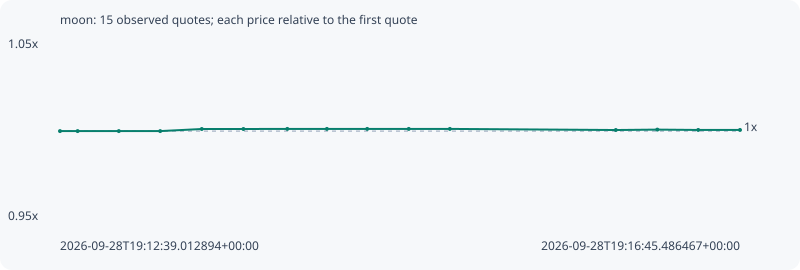

# moon

**robinhood** / `0x862cdccb67c8a22fdb247d09a08b1dad09447777`

[All tokens](README.md) · [Market window](../README.md)

## Native assessments

- [2026-09-28T19:12:39.012894Z](../cases/9b0e7b27ae4fdc7d.md): source parameters and model answers.

## Series f405a430488fb64b86fd

Pool: `not supplied`

[Complete series](../series/robinhood/f405a430488fb64b86fd.json)

Every dot is a captured quote. Lines connect observations; the curve ends at the last available quote.

| Peak | Final | Return | Maximum drawdown |
| ---: | ---: | ---: | ---: |
| 1.0012x | 1.0006x | +0.06% | 0.06% |

### Complete quote timeline

| Time (UTC) | Price (USD) | Multiple | Evidence |
| --- | ---: | ---: | --- |
| 2026-09-28T19:12:39.012894+00:00 | 0.000917888 | 1.0000x | `capture:fe8ad944-154e-4481-bd56-8ab821bfbfe1:rank:81` |
| 2026-09-28T19:12:45.402569+00:00 | 0.000917888 | 1.0000x | `capture:8deb508c-ea33-4c21-a5c5-f0991dd6dcac:rank:81` |
| 2026-09-28T19:13:00.335966+00:00 | 0.000917888 | 1.0000x | `capture:ee3ee7f8-576f-4c42-a7e0-cd9f917fdb36:rank:82` |
| 2026-09-28T19:13:15.331879+00:00 | 0.000917888 | 1.0000x | `capture:c384257a-4501-4701-8a0c-a6b08fe727d5:rank:85` |
| 2026-09-28T19:13:30.402311+00:00 | 0.000918968 | 1.0012x | `capture:44090e9e-d515-41c4-a78f-893390e6f2b0:rank:77` |
| 2026-09-28T19:13:45.493213+00:00 | 0.000918968 | 1.0012x | `capture:52264519-193b-4508-b560-e9ee4e3e0963:rank:73` |
| 2026-09-28T19:14:01.407289+00:00 | 0.000919015 | 1.0012x | `capture:0a62cce6-2c27-4761-80c1-feb9130a0c83:rank:65` |
| 2026-09-28T19:14:15.755233+00:00 | 0.000919015 | 1.0012x | `capture:09651124-e158-421c-bcdc-cb2310b48412:rank:72` |
| 2026-09-28T19:14:30.367936+00:00 | 0.000919015 | 1.0012x | `capture:7a0b9f45-7248-4af6-b349-4bf6d5ef81be:rank:73` |
| 2026-09-28T19:14:45.422215+00:00 | 0.000919015 | 1.0012x | `capture:bf6e34c4-c499-472e-8e2b-ebbb151300e2:rank:90` |
| 2026-09-28T19:15:00.325882+00:00 | 0.000919015 | 1.0012x | `capture:663c0420-2b9e-4a94-998b-531fa9202dee:rank:93` |
| 2026-09-28T19:16:00.473367+00:00 | 0.000918442 | 1.0006x | `capture:cd404827-1073-4901-b09c-82ef1488855b:rank:81` |
| 2026-09-28T19:16:15.518445+00:00 | 0.000918656 | 1.0008x | `capture:c193221c-c80a-4a3b-ad88-59f12dcb1689:rank:82` |
| 2026-09-28T19:16:30.344303+00:00 | 0.000918474 | 1.0006x | `capture:18d587e7-b24d-4b8d-82f1-0ac2903a3303:rank:87` |
| 2026-09-28T19:16:45.486467+00:00 | 0.000918474 | 1.0006x | `capture:4ca26bf7-9d1e-455b-a63e-1b5df831b997:rank:91` |

### Exit-policy timeline

Calculated from captured quotes under the window policy. Native assessments are linked separately above.

| Time (UTC) | Action | Price (USD) | Evidence |
| --- | --- | ---: | --- |
| 2026-09-28T19:12:39.012894+00:00 | BUY | 0.000917888 | `capture:fe8ad944-154e-4481-bd56-8ab821bfbfe1:rank:81` |
| 2026-09-28T19:12:45.402569+00:00 | HOLD | 0.000917888 | `capture:8deb508c-ea33-4c21-a5c5-f0991dd6dcac:rank:81` |
| 2026-09-28T19:13:00.335966+00:00 | HOLD | 0.000917888 | `capture:ee3ee7f8-576f-4c42-a7e0-cd9f917fdb36:rank:82` |
| 2026-09-28T19:13:15.331879+00:00 | HOLD | 0.000917888 | `capture:c384257a-4501-4701-8a0c-a6b08fe727d5:rank:85` |
| 2026-09-28T19:13:30.402311+00:00 | HOLD | 0.000918968 | `capture:44090e9e-d515-41c4-a78f-893390e6f2b0:rank:77` |
| 2026-09-28T19:13:45.493213+00:00 | HOLD | 0.000918968 | `capture:52264519-193b-4508-b560-e9ee4e3e0963:rank:73` |
| 2026-09-28T19:14:01.407289+00:00 | HOLD | 0.000919015 | `capture:0a62cce6-2c27-4761-80c1-feb9130a0c83:rank:65` |
| 2026-09-28T19:14:15.755233+00:00 | HOLD | 0.000919015 | `capture:09651124-e158-421c-bcdc-cb2310b48412:rank:72` |
| 2026-09-28T19:14:30.367936+00:00 | HOLD | 0.000919015 | `capture:7a0b9f45-7248-4af6-b349-4bf6d5ef81be:rank:73` |
| 2026-09-28T19:14:45.422215+00:00 | HOLD | 0.000919015 | `capture:bf6e34c4-c499-472e-8e2b-ebbb151300e2:rank:90` |
| 2026-09-28T19:15:00.325882+00:00 | HOLD | 0.000919015 | `capture:663c0420-2b9e-4a94-998b-531fa9202dee:rank:93` |
| 2026-09-28T19:16:00.473367+00:00 | HOLD | 0.000918442 | `capture:cd404827-1073-4901-b09c-82ef1488855b:rank:81` |
| 2026-09-28T19:16:15.518445+00:00 | HOLD | 0.000918656 | `capture:c193221c-c80a-4a3b-ad88-59f12dcb1689:rank:82` |
| 2026-09-28T19:16:30.344303+00:00 | HOLD | 0.000918474 | `capture:18d587e7-b24d-4b8d-82f1-0ac2903a3303:rank:87` |
| 2026-09-28T19:16:45.486467+00:00 | HOLD | 0.000918474 | `capture:4ca26bf7-9d1e-455b-a63e-1b5df831b997:rank:91` |
