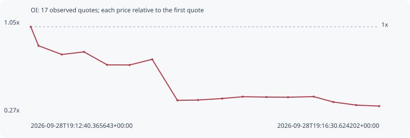

# OI

**solana** / `4gNtnJBued8iGufYCHXfbC94d7skbDnESqtyAWd6BTWw`

[All tokens](README.md) · [Market window](../README.md)

## Native assessments

This contract is in the quote cohort; it has no native model assessment in this window.

## Series 584019ab47c37b146467

Pool: `not supplied`

[Complete series](../series/solana/584019ab47c37b146467.json)

Every dot is a captured quote. Lines connect observations; the curve ends at the last available quote.

| Peak | Final | Return | Maximum drawdown |
| ---: | ---: | ---: | ---: |
| 1.0000x | 0.3199x | -68.01% | 68.01% |

### Complete quote timeline

| Time (UTC) | Price (USD) | Multiple | Evidence |
| --- | ---: | ---: | --- |
| 2026-09-28T19:12:40.365643+00:00 | 1.06569e-05 | 1.0000x | `capture:3af1faa1-2074-484e-893e-ed2c676e1576:rank:14` |
| 2026-09-28T19:12:45.490977+00:00 | 8.92569e-06 | 0.8376x | `capture:ac0279d6-7dd1-44b6-bf3e-910bf7b8eddf:rank:14` |
| 2026-09-28T19:13:00.884337+00:00 | 8.12678e-06 | 0.7626x | `capture:5867894f-39b4-4bcd-bd87-86394c63aab4:rank:13` |
| 2026-09-28T19:13:15.565374+00:00 | 8.36392e-06 | 0.7848x | `capture:ca31b3d4-ad60-4333-98b3-6d940a196f86:rank:12` |
| 2026-09-28T19:13:30.833894+00:00 | 7.1781e-06 | 0.6736x | `capture:2beb38a4-bfac-4502-bbc3-8c8c0f943007:rank:12` |
| 2026-09-28T19:13:45.640151+00:00 | 7.16545e-06 | 0.6724x | `capture:4d31b656-3ffe-4768-bef6-377adf019420:rank:13` |
| 2026-09-28T19:14:00.595194+00:00 | 7.6831e-06 | 0.7210x | `capture:2c78112b-48e7-4f74-8c2e-1cb8642a79dc:rank:13` |
| 2026-09-28T19:14:17.246316+00:00 | 3.93595e-06 | 0.3693x | `capture:7a923cde-d765-4388-a15c-4f47fde0a3b5:rank:12` |
| 2026-09-28T19:14:30.874732+00:00 | 3.96526e-06 | 0.3721x | `capture:fa585070-b1ae-4f9d-afbd-aa986f487793:rank:14` |
| 2026-09-28T19:14:46.892387+00:00 | 4.10189e-06 | 0.3849x | `capture:7d9e3e65-8bda-4696-b6d1-7a86825bd98c:rank:13` |
| 2026-09-28T19:15:00.432009+00:00 | 4.26812e-06 | 0.4005x | `capture:797f9a41-958a-44ba-ac57-3b9cacf5d06b:rank:13` |
| 2026-09-28T19:15:16.098308+00:00 | 4.23637e-06 | 0.3975x | `capture:ab2becb9-3f94-4a57-b9e8-472ad0998012:rank:13` |
| 2026-09-28T19:15:30.340579+00:00 | 4.22173e-06 | 0.3961x | `capture:564db5fc-5586-41d3-88fb-a9a955708f1d:rank:13` |
| 2026-09-28T19:15:47.323285+00:00 | 4.27494e-06 | 0.4011x | `capture:65003429-a569-4442-8d4f-b2c93db69061:rank:13` |
| 2026-09-28T19:16:00.259696+00:00 | 3.78484e-06 | 0.3552x | `capture:4236f8d5-90c4-4c9b-a73e-d6443ae3bf32:rank:14` |
| 2026-09-28T19:16:15.455827+00:00 | 3.49939e-06 | 0.3284x | `capture:acc657c6-9a43-46bf-986e-7b907c831cba:rank:16` |
| 2026-09-28T19:16:30.624202+00:00 | 3.4094e-06 | 0.3199x | `capture:0d391072-ec81-4bb7-9be0-0d6bbb801c70:rank:19` |

### Exit-policy timeline

Calculated from captured quotes under the window policy. Native assessments are linked separately above.

| Time (UTC) | Action | Price (USD) | Evidence |
| --- | --- | ---: | --- |
| 2026-09-28T19:12:40.365643+00:00 | BUY | 1.06569e-05 | `capture:3af1faa1-2074-484e-893e-ed2c676e1576:rank:14` |
| 2026-09-28T19:12:45.490977+00:00 | SL | 8.92569e-06 | `capture:ac0279d6-7dd1-44b6-bf3e-910bf7b8eddf:rank:14` |
