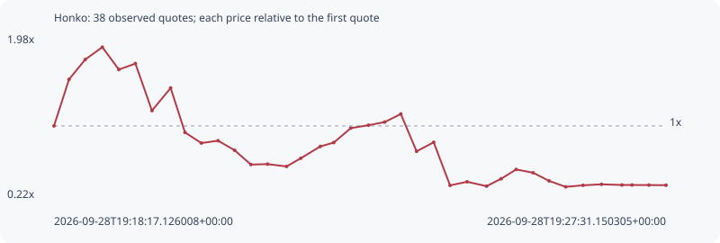

# Honko

**solana** / `2yKzF3hBYZbeYn3wid5vBKDpVqpDxGX11QrB13cqtzkJ`

[All tokens](README.md) · [Market window](../README.md)

## Native assessments

This contract is in the quote cohort; it has no native model assessment in this window.

## Series 2a0e85fcd9b58ca9df80

Pool: `not supplied`

[Complete series](../series/solana/2a0e85fcd9b58ca9df80.json)

Every dot is a captured quote. Lines connect observations; the curve ends at the last available quote.

| Peak | Final | Return | Maximum drawdown |
| ---: | ---: | ---: | ---: |
| 1.8545x | 0.3568x | -64.32% | 81.71% |

### Complete quote timeline

| Time (UTC) | Price (USD) | Multiple | Evidence |
| --- | ---: | ---: | --- |
| 2026-09-28T19:18:17.126008+00:00 | 1.61305e-05 | 1.0000x | `capture:5ed98f51-d1e1-422a-81df-4186a8b0a0a2:rank:34` |
| 2026-09-28T19:18:30.722167+00:00 | 2.4275e-05 | 1.5049x | `capture:9f88d118-9108-4dff-bbfc-246eaed5ce38:rank:21` |
| 2026-09-28T19:18:45.386687+00:00 | 2.77562e-05 | 1.7207x | `capture:f533100a-ce62-4457-9107-42e7601ea5d7:rank:15` |
| 2026-09-28T19:19:00.883835+00:00 | 2.99136e-05 | 1.8545x | `capture:a2495d99-5671-4c7e-b87c-48f48d90f2f2:rank:9` |
| 2026-09-28T19:19:15.826416+00:00 | 2.59986e-05 | 1.6118x | `capture:ba1dc6a3-b8b7-461a-8110-8490f03539a5:rank:7` |
| 2026-09-28T19:19:30.814098+00:00 | 2.70417e-05 | 1.6764x | `capture:b25d90dc-c8db-4388-8a2b-d06541e5320f:rank:6` |
| 2026-09-28T19:19:45.817199+00:00 | 1.88097e-05 | 1.1661x | `capture:722d1b7b-ef4f-4ac5-883c-0557bae2b60b:rank:6` |
| 2026-09-28T19:20:02.715590+00:00 | 2.27706e-05 | 1.4116x | `capture:60ff17d8-3b18-4f61-9bc7-006afd324cf2:rank:6` |
| 2026-09-28T19:20:15.699547+00:00 | 1.49889e-05 | 0.9292x | `capture:10a94828-637f-4580-a9f7-2fbd34d8589a:rank:4` |
| 2026-09-28T19:20:30.480194+00:00 | 1.31344e-05 | 0.8143x | `capture:54722132-db1d-4a2b-8c1c-2b0e71d01430:rank:4` |
| 2026-09-28T19:20:45.683165+00:00 | 1.35434e-05 | 0.8396x | `capture:17963a37-fd65-46b6-8e1c-350082721f8c:rank:4` |
| 2026-09-28T19:21:00.690136+00:00 | 1.18588e-05 | 0.7352x | `capture:f2ff842d-38e9-4cbe-a281-98c17d5a5672:rank:4` |
| 2026-09-28T19:21:15.372716+00:00 | 9.36786e-06 | 0.5808x | `capture:a923b968-a768-495e-ae33-6de2042c551f:rank:3` |
| 2026-09-28T19:21:30.402460+00:00 | 9.44684e-06 | 0.5857x | `capture:d926629b-2050-4e50-a602-1638c6205870:rank:3` |
| 2026-09-28T19:21:47.649380+00:00 | 9.03966e-06 | 0.5604x | `capture:0799ec6d-0e89-46b5-ae88-5695bf6c5fc3:rank:4` |
| 2026-09-28T19:22:00.569928+00:00 | 1.04744e-05 | 0.6494x | `capture:263cda40-4b31-4b2d-b168-fa4310edb46d:rank:4` |
| 2026-09-28T19:22:18.240717+00:00 | 1.25429e-05 | 0.7776x | `capture:546b2c55-1845-4da7-bc9c-4439cd0ccdba:rank:3` |
| 2026-09-28T19:22:30.371968+00:00 | 1.3213e-05 | 0.8191x | `capture:507d17cb-af67-4a81-a2b2-d5ddfbc40021:rank:2` |
| 2026-09-28T19:22:45.783808+00:00 | 1.57434e-05 | 0.9760x | `capture:9558d322-c429-480b-885f-82f4481c8506:rank:3` |
| 2026-09-28T19:23:01.833252+00:00 | 1.6261e-05 | 1.0081x | `capture:c5462412-2da1-4432-8949-8fcd1492c57f:rank:3` |
| 2026-09-28T19:23:16.460099+00:00 | 1.68031e-05 | 1.0417x | `capture:2d456a2a-6755-4e1d-9a80-b6e3b2d44ec1:rank:2` |
| 2026-09-28T19:23:31.092727+00:00 | 1.82195e-05 | 1.1295x | `capture:0e687519-8b01-4d7e-b48c-e2ec34135d17:rank:2` |
| 2026-09-28T19:23:45.375171+00:00 | 1.16855e-05 | 0.7244x | `capture:1b404fa0-870b-4e7c-bafd-c3ef241c5093:rank:4` |
| 2026-09-28T19:24:00.852400+00:00 | 1.32671e-05 | 0.8225x | `capture:5205c587-4734-452c-b758-46c4814dded1:rank:6` |
| 2026-09-28T19:24:15.655418+00:00 | 5.72409e-06 | 0.3549x | `capture:5b9df0f6-51c0-4dbb-9de7-7df7a46bfee0:rank:7` |
| 2026-09-28T19:24:31.056437+00:00 | 6.35488e-06 | 0.3940x | `capture:971b5dda-397d-4fe7-b49e-94713bb088df:rank:8` |
| 2026-09-28T19:24:48.687179+00:00 | 5.58656e-06 | 0.3463x | `capture:feb72cbd-a170-4ba3-8a11-eb1df1686719:rank:11` |
| 2026-09-28T19:25:01.877958+00:00 | 6.87749e-06 | 0.4264x | `capture:fd6d01ae-d246-439e-ac58-27ae75880eb9:rank:12` |
| 2026-09-28T19:25:15.488701+00:00 | 8.51274e-06 | 0.5277x | `capture:b8fee87c-9981-475c-930b-99c255910a9f:rank:12` |
| 2026-09-28T19:25:30.900173+00:00 | 7.92957e-06 | 0.4916x | `capture:7f757769-25c3-429a-81d0-c6b2ee45ee15:rank:13` |
| 2026-09-28T19:25:45.342895+00:00 | 6.50816e-06 | 0.4035x | `capture:0ca3656d-ce8c-444b-8f77-acf34c08a1f4:rank:14` |
| 2026-09-28T19:26:00.340634+00:00 | 5.47153e-06 | 0.3392x | `capture:5b3728c5-aff9-43f3-bbb5-25b251825caa:rank:16` |
| 2026-09-28T19:26:16.031602+00:00 | 5.73562e-06 | 0.3556x | `capture:bb8d4bfc-85e1-4d55-a2ff-e47193bcce5f:rank:20` |
| 2026-09-28T19:26:32.771713+00:00 | 5.91246e-06 | 0.3665x | `capture:2fed7296-b3d1-4ba6-8398-799ee55f1f2b:rank:23` |
| 2026-09-28T19:26:51.267717+00:00 | 5.79198e-06 | 0.3591x | `capture:4cc162c2-aa4a-403b-a901-4bb5058380d6:rank:25` |
| 2026-09-28T19:27:00.453239+00:00 | 5.79198e-06 | 0.3591x | `capture:4273fbb8-5342-4e37-8d61-ced6b88e542d:rank:26` |
| 2026-09-28T19:27:15.715818+00:00 | 5.77987e-06 | 0.3583x | `capture:d04c9116-4617-4b61-8b98-5489321cd1cc:rank:26` |
| 2026-09-28T19:27:31.150305+00:00 | 5.75493e-06 | 0.3568x | `capture:7cad37e8-83d3-4438-8055-245db6707e2e:rank:24` |

### Exit-policy timeline

Calculated from captured quotes under the window policy. Native assessments are linked separately above.

| Time (UTC) | Action | Price (USD) | Evidence |
| --- | --- | ---: | --- |
| 2026-09-28T19:18:17.126008+00:00 | BUY | 1.61305e-05 | `capture:5ed98f51-d1e1-422a-81df-4186a8b0a0a2:rank:34` |
| 2026-09-28T19:18:30.722167+00:00 | TP | 2.4275e-05 | `capture:9f88d118-9108-4dff-bbfc-246eaed5ce38:rank:21` |
