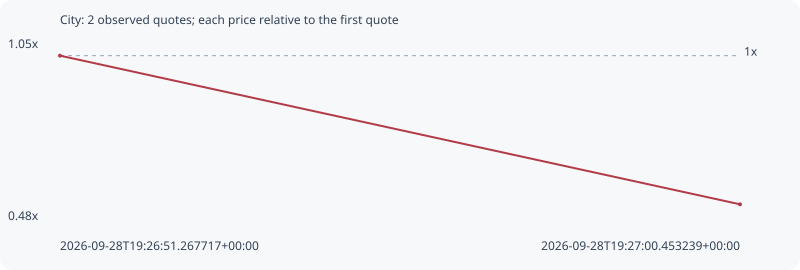

# City

**solana** / `3pEnLWyukwgM2VdHTFWqpFV2CHpU1LAE8qPNjVvwAtRt`

[All tokens](README.md) · [Market window](../README.md)

## Native assessments

This contract is in the quote cohort; it has no native model assessment in this window.

## Series 6fe55726ffa8924eb01c

Pool: `not supplied`

[Complete series](../series/solana/6fe55726ffa8924eb01c.json)

Every dot is a captured quote. Lines connect observations; the curve ends at the last available quote.

| Peak | Final | Return | Maximum drawdown |
| ---: | ---: | ---: | ---: |
| 1.0000x | 0.5257x | -47.43% | 47.43% |

### Complete quote timeline

| Time (UTC) | Price (USD) | Multiple | Evidence |
| --- | ---: | ---: | --- |
| 2026-09-28T19:26:51.267717+00:00 | 7.42439e-06 | 1.0000x | `capture:4cc162c2-aa4a-403b-a901-4bb5058380d6:rank:74` |
| 2026-09-28T19:27:00.453239+00:00 | 3.9033e-06 | 0.5257x | `capture:4273fbb8-5342-4e37-8d61-ced6b88e542d:rank:63` |

### Exit-policy timeline

Calculated from captured quotes under the window policy. Native assessments are linked separately above.

| Time (UTC) | Action | Price (USD) | Evidence |
| --- | --- | ---: | --- |
| 2026-09-28T19:26:51.267717+00:00 | BUY | 7.42439e-06 | `capture:4cc162c2-aa4a-403b-a901-4bb5058380d6:rank:74` |
| 2026-09-28T19:27:00.453239+00:00 | SL | 3.9033e-06 | `capture:4273fbb8-5342-4e37-8d61-ced6b88e542d:rank:63` |
