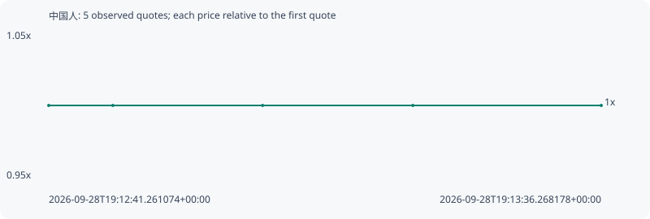

# 中国人

**bsc** / `0xa01d75690d9604eb96cc307fd82efd8612fd7777`

[All tokens](README.md) · [Market window](../README.md)

## Native assessments

This contract is in the quote cohort; it has no native model assessment in this window.

## Series e71abf80213ace02cb96

Pool: `not supplied`

[Complete series](../series/bsc/e71abf80213ace02cb96.json)

Every dot is a captured quote. Lines connect observations; the curve ends at the last available quote.

| Peak | Final | Return | Maximum drawdown |
| ---: | ---: | ---: | ---: |
| 1.0000x | 1.0000x | +0.00% | 0.00% |

### Complete quote timeline

| Time (UTC) | Price (USD) | Multiple | Evidence |
| --- | ---: | ---: | --- |
| 2026-09-28T19:12:41.261074+00:00 | 2.09852e-05 | 1.0000x | `capture:795a88f0-804c-4f14-a3e8-ce8d9318f6df:rank:77` |
| 2026-09-28T19:12:47.639745+00:00 | 2.09852e-05 | 1.0000x | `capture:c2d8bd1a-9ed6-4d75-91ae-006bea65a635:rank:81` |
| 2026-09-28T19:13:02.549284+00:00 | 2.09852e-05 | 1.0000x | `capture:0aa38b41-b2e7-48f5-a3ba-8fd4a983fff8:rank:81` |
| 2026-09-28T19:13:17.511052+00:00 | 2.09852e-05 | 1.0000x | `capture:87e92f15-0601-4987-bd47-ae2e9f91de16:rank:82` |
| 2026-09-28T19:13:36.268178+00:00 | 2.09852e-05 | 1.0000x | `capture:577859f6-aadc-4653-b269-a860dbe8c41c:rank:95` |

### Exit-policy timeline

Calculated from captured quotes under the window policy. Native assessments are linked separately above.

| Time (UTC) | Action | Price (USD) | Evidence |
| --- | --- | ---: | --- |
| 2026-09-28T19:12:41.261074+00:00 | BUY | 2.09852e-05 | `capture:795a88f0-804c-4f14-a3e8-ce8d9318f6df:rank:77` |
| 2026-09-28T19:12:47.639745+00:00 | HOLD | 2.09852e-05 | `capture:c2d8bd1a-9ed6-4d75-91ae-006bea65a635:rank:81` |
| 2026-09-28T19:13:02.549284+00:00 | HOLD | 2.09852e-05 | `capture:0aa38b41-b2e7-48f5-a3ba-8fd4a983fff8:rank:81` |
| 2026-09-28T19:13:17.511052+00:00 | HOLD | 2.09852e-05 | `capture:87e92f15-0601-4987-bd47-ae2e9f91de16:rank:82` |
| 2026-09-28T19:13:36.268178+00:00 | HOLD | 2.09852e-05 | `capture:577859f6-aadc-4653-b269-a860dbe8c41c:rank:95` |
