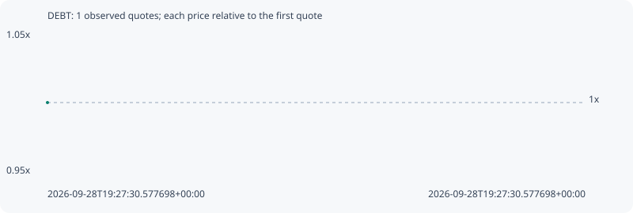

# DEBT

**robinhood** / `0x41ca1a94f5262c4a84fafdaa23b9499aa5b9fcd0`

[All tokens](README.md) · [Market window](../README.md)

## Native assessments

This contract is in the quote cohort; it has no native model assessment in this window.

## Series 5110978ae4a741686ec2

Pool: `not supplied`

[Complete series](../series/robinhood/5110978ae4a741686ec2.json)

Every dot is a captured quote. Lines connect observations; the curve ends at the last available quote.

Fewer than two quotes: return and drawdown are not calculated.

### Complete quote timeline

| Time (UTC) | Price (USD) | Multiple | Evidence |
| --- | ---: | ---: | --- |
| 2026-09-28T19:27:30.577698+00:00 | 3.80352e-05 | 1.0000x | `capture:ff6b3949-9c3c-4cdf-b48c-d4010666c140:rank:89` |

### Exit-policy timeline

Calculated from captured quotes under the window policy. Native assessments are linked separately above.

| Time (UTC) | Action | Price (USD) | Evidence |
| --- | --- | ---: | --- |
